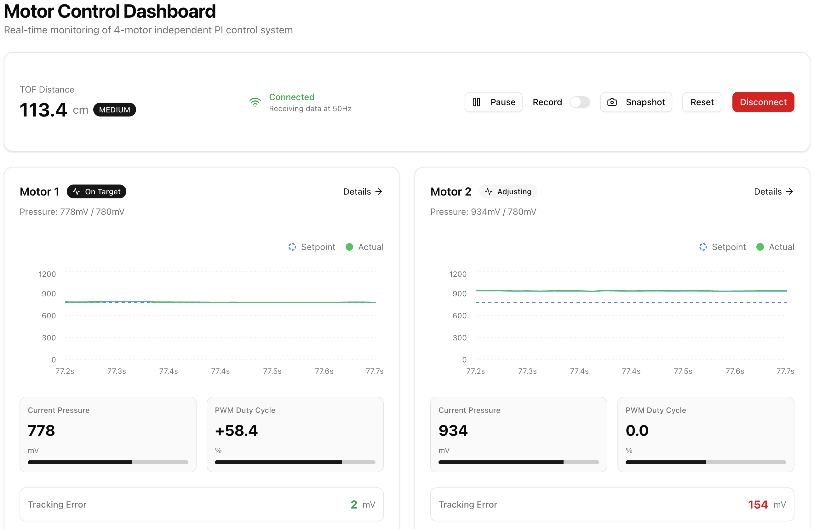
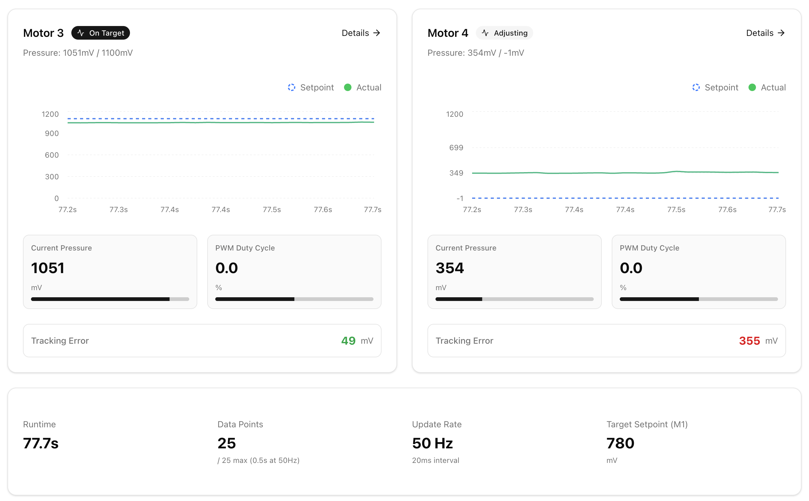
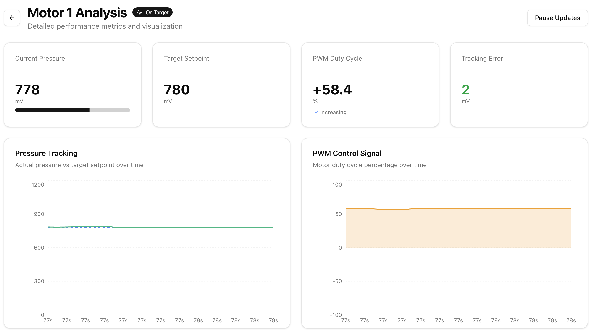
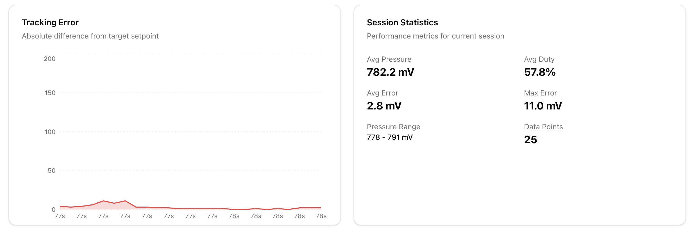
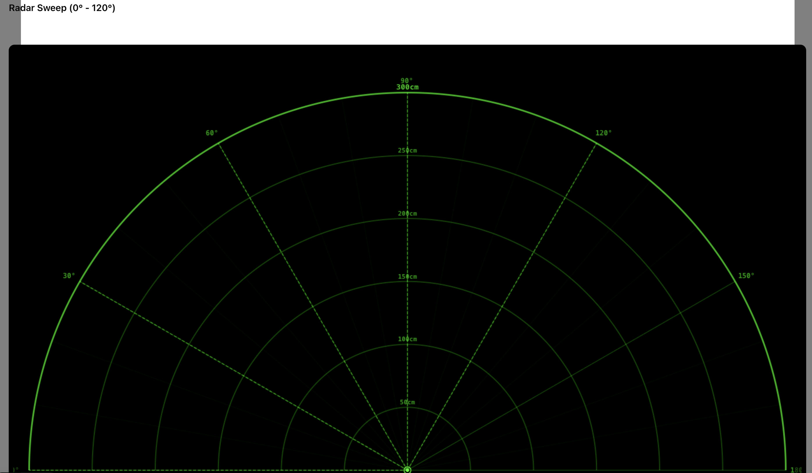
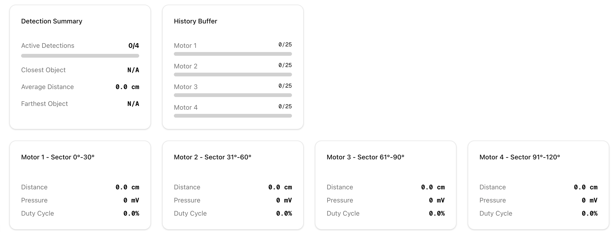

# 5-Motor Independent PI Control with Servo Sweep TOF Sensing

A robust ESP32-S3-based control system that independently controls 5 DC motors using PI controllers, with dynamic setpoints calculated from TOF (Time-of-Flight) distance sensor readings across 5 sectors using servo sweep.

## Features

- **5 Independent Motors**: Each motor has its own pressure pad sensor and PI controller
- **Sector-Based Distance Sensing**: Servo sweeps 5°-175° divided into 5 sectors (one per motor)
  - Motor 1: 5° - 39° sector (34° range)
  - Motor 2: 39° - 73° sector (34° range)
  - Motor 3: 73° - 107° sector (34° range)
  - Motor 4: 107° - 141° sector (34° range)
  - Motor 5: 141° - 175° sector (34° range)
- **Dynamic Setpoints**: Each motor calculates its setpoint based on minimum distance in its sector
- **Multi-Core Architecture**: Utilizes both ESP32-S3 cores for parallel processing
  - Core 0: Servo sweep, TOF scanning, and data logging
  - Core 1: Real-time PI control at 50 Hz for all 5 motors
- **Adaptive Range Control**: Different control strategies for CLOSE (50-100cm), MEDIUM (100-200cm), and FAR (200-300cm) distance ranges
- **Out-of-Range Protection**: Automatic deflation when object distance is invalid or out of bounds
- **Real-time Data Streaming**: Binary protocol (86 bytes) or CSV format for visualization and analysis
- **Web Dashboard**: Real-time visualization with React/Next.js frontend including radar display

## Hardware Requirements

### Main Components

- **ESP32-S3-DevKitC-1U** (dual-core microcontroller)
- **5× DC Motors** with H-bridge drivers (L298N, TB6612, or similar)
- **5× Pressure Pad Sensors** (FSR or similar analog sensors)
- **1× TOF Distance Sensor** (serial UART interface, 921600 baud)
- **1× Servo Motor** (for TOF scanning mechanism, 5°-175° sweep)
- **1× CD74HC4067** 16-channel analog multiplexer

### Pin Connections

See [docs/hardware.md](docs/hardware.md) for complete wiring diagram and pin mappings.

**Quick Reference:**
- Servo: GPIO 6 (PWM, timer 2)
- TOF Sensor: RX on GPIO 34, TX on GPIO 18
- Pressure Pads: Multiplexer channels C1, C2, C3, C6, C8
- Motors: H-bridge connections via GPIOs (see hardware.md)

## Quick Start

### 1. Hardware Setup

1. Connect the 5 motors to H-bridge drivers
2. Wire pressure pads to multiplexer channels (C1, C2, C3, C6, C8)
3. Connect TOF sensor to Serial1 (RX=GPIO34, TX=GPIO18)
4. Attach servo to GPIO22 (3.3V or 5V power, depending on servo specs)
5. Connect multiplexer control pins (S0-S3) and signal pin

### 2. ESP32 Firmware Setup

#### Visual Studio Code + PlatformIO

1. **Install VS Code** (if not already installed):
   - Download from [https://code.visualstudio.com/](https://code.visualstudio.com/)

2. **Install PlatformIO Extension**:
   - Open VS Code
   - Go to Extensions (Ctrl+Shift+X / Cmd+Shift+X)
   - Search for "PlatformIO IDE"
   - Click Install

3. **Open the Project**:
   - File → Open Folder → Select `Project`
   - PlatformIO will automatically install dependencies (ESP32Servo library)

4. **Build and Upload**:
   - **Build**: Click the ✓ icon in the bottom toolbar or press `Ctrl+Alt+B` (Windows/Linux) / `Cmd+Shift+B` (Mac)
   - **Upload**: Click the → icon in the bottom toolbar or press `Ctrl+Alt+U` (Windows/Linux) / `Cmd+Shift+U` (Mac)
   - **Serial Monitor**: Click the 🔌 icon or press `Ctrl+Alt+S` (Windows/Linux) / `Cmd+Shift+S` (Mac)

**Alternative: Command Line**

```bash
# Navigate to project directory
cd Project

# Build the project
~/.platformio/penv/bin/pio run

# Upload to ESP32
~/.platformio/penv/bin/pio run --target upload

# Open serial monitor
~/.platformio/penv/bin/pio device monitor
```

### 3. Frontend Setup

The project includes a Next.js web dashboard for real-time visualization:

```bash
# Navigate to frontend directory
cd frontend

# Install dependencies
pnpm install

# Start the WebSocket bridge and dev server (automatically connects to ESP32)
pnpm run dev:serial
```

Open browser to `http://localhost:3000` to view:
- **Main Dashboard**: 5-motor overview with live pressure, duty cycle, and distance data
- **Radar Page**: Real-time TOF sweep visualization showing detected objects
- **Mode B Page**: Alternative motor view with sector-specific data

For detailed frontend setup, see [frontend/README.md](frontend/README.md)

### 4. Verification

After uploading, you should see:

```
========================================
5-Motor Independent PI Control System
With Servo Sweep and TOF Distance Sensing
========================================
Protocol: Binary
Logging Rate: 50 Hz
========================================

Initializing hardware...
  - TOF sensor... OK
  - Pressure pads... OK
  - Motors... OK
  - PI controllers... OK

Starting Core 0 tasks...
  - Servo sweep task started on Core 0
  - Serial print task started on Core 0

Initialization complete!
Starting PI control loop on Core 1 at 50 Hz...
```

Then binary data packets (70 bytes) or CSV data will stream continuously.

## Project Structure

```
Project/
├── README.md                         # This file
├── platformio.ini                    # PlatformIO configuration
├── Claude.md                         # AI development guidelines
├── docs/                             # Documentation
│   ├── architecture.md               # System architecture
│   ├── hardware.md                   # Pin mappings & wiring
│   ├── control-system.md             # PI controller details
│   ├── communication.md              # Inter-core communication
│   └── project-structure.md          # Code organization
├── src/
│   ├── main.cpp                      # Main program (Core 1 control loop)
│   ├── config/
│   │   ├── pins.h                    # Pin definitions
│   │   └── system_config.h           # Protocol and logging configuration
│   ├── sensors/
│   │   ├── tof_sensor.cpp/.h         # TOF + servo sweep (5 sectors)
│   │   └── pressure_pads.cpp/.h      # Pressure pad reading via multiplexer
│   ├── actuators/
│   │   └── motors.cpp/.h             # Motor control (5 motors)
│   ├── control/
│   │   └── pi_controller.cpp/.h      # PI controllers (5 independent)
│   ├── utils/
│   │   ├── multiplexer.cpp/.h        # Multiplexer functions
│   │   └── binary_protocol.cpp/.h    # Binary data packet encoding
│   └── tasks/
│       └── core0_tasks.cpp/.h        # FreeRTOS tasks (sweep + logging)
├── frontend/                         # Next.js web dashboard
│   ├── dev/
│   │   └── serial-ws-bridge.ts       # WebSocket bridge for ESP32 serial data
│   ├── src/
│   │   ├── app/                      # Pages (dashboard, radar, motor detail)
│   │   ├── components/               # React components
│   │   └── lib/                      # WebSocket store, types, parsers
│   └── README.md                     # Frontend documentation
```

## Configuration

### Serial Output Protocol

The system supports two output protocols. Edit `src/config/system_config.h`:

```cpp
// Uncomment ONE of the following lines:
//#define PROTOCOL_CSV     // Human-readable CSV format
#define PROTOCOL_BINARY   // High-performance binary format (recommended)
```

**CSV Protocol:**
- Human-readable
- Easy to debug with serial monitor
- ~65 bytes per line
- Compatible with any serial terminal

**Binary Protocol:**
- 35% smaller (70 bytes/packet)
- 3-5x faster parsing
- CRC-16 error detection
- Required for frontend dashboard

### Logging Rate

Edit `src/config/system_config.h`:

```cpp
// Uncomment ONE of the following lines:
//#define LOGGING_RATE_10HZ   // 100ms - Best for visualization
//#define LOGGING_RATE_25HZ   // 40ms - Balanced
#define LOGGING_RATE_50HZ    // 20ms - Matches control rate (default)
//#define LOGGING_RATE_100HZ  // 10ms - Maximum detail
```

### PI Controller Tuning

Edit `src/control/pi_controller.cpp`:

```cpp
static float Kp = 0.15f;  // Proportional gain
static float Ki = 0.60f;  // Integral gain
```

### Distance Ranges

Edit `src/sensors/tof_sensor.h`:

```cpp
constexpr float DISTANCE_CLOSE_MIN = 50.0f;    // 50-100 cm
constexpr float DISTANCE_MEDIUM_MIN = 100.0f;  // 100-200 cm
constexpr float DISTANCE_FAR_MIN = 200.0f;     // 200-300 cm
```

### Setpoints

Edit `src/sensors/tof_sensor.h`:

```cpp
constexpr float SETPOINT_CLOSE_MV = 1100.0f;   // Close range setpoint
constexpr float SETPOINT_MEDIUM_MV = 780.0f;   // Medium range setpoint
constexpr float SECURITY_OFFSET_MV = 50.0f;    // Far range offset
```

## How It Works

### Servo Sweep and Distance Tracking (Core 0)

1. Servo continuously sweeps from 5° to 175° in steps (bidirectional mode supported)
2. At each angle, TOF sensor reads distance
3. Minimum distance is tracked independently for each of 5 sectors:
   - Motor 1 sector: 5° - 39° (34° range)
   - Motor 2 sector: 39° - 73° (34° range)
   - Motor 3 sector: 73° - 107° (34° range)
   - Motor 4 sector: 107° - 141° (34° range)
   - Motor 5 sector: 141° - 175° (34° range)
4. When a sector completes, its minimum distance is immediately shared with Core 1 (via mutex-protected variable)
5. Sweep continues indefinitely

### PI Control Loop (Core 1)

1. Runs at 50 Hz (every 20 ms)
2. Reads all 5 pressure pads via multiplexer
3. For each motor independently:
   - Get minimum distance from its sector
   - Classify distance into range (CLOSE, MEDIUM, FAR)
   - Calculate setpoint based on range:
     - **CLOSE** (50-100 cm): High pressure setpoint (1100 mV)
     - **MEDIUM** (100-200 cm): Medium pressure setpoint (780 mV)
     - **FAR** (200-300 cm): Dynamic setpoint (baseline pressure + 50 mV)
   - PI controller compares pressure to setpoint
   - Calculate duty cycle to reach setpoint
   - Apply motor command
4. Update shared variables for logging

### Safety State Machine (Per Motor)

Each motor has an independent state machine:

- **NORMAL_OPERATION**: PI control active
- **OUT_OF_RANGE_DEFLATING**: Distance invalid, reversing motor to deflate until pressure drops below safe threshold
- **OUT_OF_RANGE_RELEASING**: Pressure safe but distance still invalid, continue reversing for release period
- **WAITING_FOR_VALID_READING**: Waiting for valid distance and safe pressure before resuming PI control

## Data Format

### Binary Protocol (86 bytes)

```
[0-1]   Header: 0xAA 0x55
[2-5]   Timestamp (uint32_t, milliseconds)
[6-25]  Setpoints: 5× float (sp1, sp2, sp3, sp4, sp5)
[26-35] Pressure Pads: 5× uint16_t (pp1, pp2, pp3, pp4, pp5)
[36-55] Duty Cycles: 5× float (duty1, duty2, duty3, duty4, duty5)
[56-75] TOF Distances: 5× float (tof1, tof2, tof3, tof4, tof5)
[76]    Servo Angle (uint8_t, 5-175)
[77-80] Current TOF Reading: float
[81]    Mode Byte (always 1 = sweep mode)
[82-83] CRC-16
```

### CSV Protocol

```
time_ms,sp1_mv,sp2_mv,sp3_mv,sp4_mv,sp5_mv,pp1_mv,pp2_mv,pp3_mv,pp4_mv,pp5_mv,duty1_pct,duty2_pct,duty3_pct,duty4_pct,duty5_pct,tof1_cm,tof2_cm,tof3_cm,tof4_cm,tof5_cm,servo_angle
1234,850.0,850.0,850.0,850.0,850.0,820,835,845,830,825,45.23,38.67,42.11,41.89,43.50,156.78,142.34,165.23,158.91,160.45,90
```

## Safety Features

- **Out-of-Range Detection**: If distance is invalid (<0 cm or >300 cm), motor enters deflation state
- **Pressure Safety**: Motors won't resume PI control until pressure drops below safe threshold (600 mV)
- **Anti-Windup**: PI integrators are clamped to prevent excessive accumulation
- **Deadband**: Motors require minimum 40% duty to overcome static friction
- **Independent State Machines**: Each motor can deflate/recover independently without affecting others
- **Mutex Protection**: Thread-safe access to shared variables between cores

## Troubleshooting

### Motors not moving
- Check H-bridge connections and power supply
- Verify `MIN_RUN` threshold in `pi_controller.cpp` (default: 40%)
- Ensure pressure pads are connected and reading values
- Check serial output for motor state (should be NORMAL_OPERATION)

### TOF sensor showing 999 cm
- Verify baud rate is 921600
- Check RX/TX pins (RX=GPIO34, TX=GPIO18)
- Ensure TOF sensor is powered (usually 3.3V or 5V)
- Verify wiring: TOF TX → ESP32 RX (GPIO34), TOF RX → ESP32 TX (GPIO18)

### Servo not moving
- Check servo power supply (3.3V or 5V, separate from logic if high current)
- Verify servo is connected to GPIO22
- Ensure timer 2 is allocated for servo (in tof_sensor.cpp)
- Adjust `SERVO_SETTLE_MS` in `pins.h` for slower servos

### Servo moves erratically or conflicts with motors
- **Fixed in current version**: Servo now uses dedicated timer 2, motors use default timers
- If still experiencing issues, check for PWM channel conflicts in motor driver

### Pressure readings are noisy
- Increase `PP_SAMPLES` in `pins.h` (default: 8)
- Check multiplexer wiring and ground connections
- Ensure proper ADC reference voltage

### Frontend not receiving data
- Ensure binary protocol is enabled (`PROTOCOL_BINARY` in system_config.h)
- Check that no debug Serial.print statements exist in loop/tasks
- Verify WebSocket bridge is running (`pnpm run dev:serial`)
- Check serial port matches ESP32 port (`SERIAL_PORT=/dev/cu.usbserial-10`)

## Frontend Screenshots

The web dashboard provides real-time visualization of all system data:

### Main Dashboard
Overview of all 5 motors with live pressure, duty cycle, distance, and setpoint data.


*Upper section: System status, connection controls, and real-time metrics*


*Lower section: 5-motor grid with individual motor cards showing live data*

### Motor Detail View
Detailed view for individual motor analysis with historical charts.


*Upper section: Motor-specific metrics and real-time values*


*Lower section: Historical charts for pressure, duty cycle, and distance tracking*

### Radar Visualization
Live TOF sensor sweep visualization showing detected objects in 5 sectors (5°-175°).


*Upper section: Radar polar plot with servo sweep and sector-based distance tracking*


*Lower section: Sector statistics showing min distance and best angle per motor*

## Further Documentation

- [Architecture Overview](docs/architecture.md) - System design and data flow
- [Hardware Guide](docs/hardware.md) - Complete pin mappings and wiring
- [Control System](docs/control-system.md) - PI controller theory and tuning
- [Communication](docs/communication.md) - FreeRTOS and inter-core details
- [Variables Reference](docs/variables-reference.md) - Complete list of all variables and constants
- [Frontend README](frontend/README.md) - Web dashboard setup and usage

## License

This project is provided as-is for educational and research purposes.

## Authors

EPFL - Semester Project 2025
