# ESP32-S3 Pin Configuration Guide

## Why GPIO 19 and GPIO 20 Cannot Be Used for Motors

**Critical Issue:** GPIO 19 and GPIO 20 are **hardwired to USB D- and D+ on the ESP32-S3**.

### The Problem

When you connect:
- `M1_PWM = GPIO 19` → Interferes with **USB D-** (data negative line)
- `M1_IN2 = GPIO 20` → Interferes with **USB D+** (data positive line)

**Result:** You **lose USB serial communication** completely. The ESP32-S3 cannot communicate with your computer via USB, making it impossible to:
- Upload firmware
- Monitor serial output
- Debug the system

### The Solution

We moved these pins to safe GPIOs:
- `M1_PWM = GPIO 5` ✅ (Safe general-purpose GPIO)
- `M1_IN2 = GPIO 14` ✅ (Safe general-purpose GPIO)

---

## ESP32-S3 GPIO Categories

### ❌ RESERVED - Never Use These

| GPIO Range | Purpose | Why Reserved |
|------------|---------|--------------|
| **GPIO 26-32** | Flash/PSRAM | Connected to internal flash memory - **CRITICAL** |
| **GPIO 19, 20** | USB D-, D+ | USB serial communication (programming & debugging) |
| **GPIO 43, 44** | USB Serial/JTAG TX/RX | Alternative USB CDC interface |

**Using these pins will brick your board or make it unprogrammable!**

---

### ⚠️ STRAPPING PINS - Use with Caution

| GPIO | Boot Function | Notes |
|------|---------------|-------|
| **GPIO 0** | Boot mode select | Pull LOW = download mode, Pull HIGH = normal boot |
| **GPIO 3** | JTAG enable | Controls JTAG debugging interface |
| **GPIO 45** | VDD_SPI voltage | Flash voltage selection (1.8V or 3.3V) |
| **GPIO 46** | Boot mode | ROM messages enable/disable |

**Can be used after boot, but avoid if possible - may cause boot issues if connected to loads.**

---

### 🟡 INPUT-ONLY PINS

These pins can **ONLY read signals**, not drive motors or LEDs:

**None on ESP32-S3!** (Unlike original ESP32 which had GPIO 34-39 as input-only)

---

### ✅ SAFE GENERAL-PURPOSE PINS

These are **safe to use** for motors, sensors, and other peripherals:

**Recommended GPIO Pins:**
- GPIO 1, 2, 4, 5, 6, 7, 8, 9, 10, 11, 12, 13, 14, 15, 16, 17, 18, 21
- GPIO 33, 34, 35, 36, 37, 38, 39, 40, 41, 42
- GPIO 47, 48

**Total: 33 safe GPIO pins available**

---

## Current Pin Mapping

### Motor System (5 Motors)

| Motor | PWM Pin | IN1 Pin | IN2 Pin | Notes |
|-------|---------|---------|---------|-------|
| **Motor 1** | GPIO 14 | GPIO 13 | GPIO 21 | Changed from 19/20 for USB compatibility |
| **Motor 2** | GPIO 35 | GPIO 48 | GPIO 47 | Safe pins |
| **Motor 3** | GPIO 36 | GPIO 37 | GPIO 38 | Safe pins |
| **Motor 4** | GPIO 41 | GPIO 39 | GPIO 40 | Safe pins |
| **Motor 5** | GPIO 42 | GPIO 1 | GPIO 2 | IN1/IN2 swapped to correct direction |

**PWM Configuration:**
- Frequency: 20 kHz
- Resolution: 10-bit (0-1023)
- Channels: Auto-assigned (0-4)

---

### TOF Distance Sensor

| Function | GPIO | Notes |
|----------|------|-------|
| **RX** | GPIO 10 | Safe UART pin |
| **TX** | GPIO 11 | Safe UART pin |
| **Servo** | GPIO 6 | PWM for servo sweep |

**Why GPIO 10/11 instead of GPIO 43/44?**
- GPIO 43/44 are USB CDC pins - caused system hang
- GPIO 10/11 are dedicated UART pins, work perfectly

**UART Configuration:**
- Baud Rate: 921600
- Protocol: 8N1 (8 data bits, no parity, 1 stop bit)

---

### Pressure Pad Multiplexer

| Function | GPIO | Notes |
|----------|------|-------|
| **MUX S0** | GPIO 17 | Channel select bit 0 |
| **MUX S1** | GPIO 16 | Channel select bit 1 |
| **MUX S2** | GPIO 15 | Channel select bit 2 |
| **MUX S3** | GPIO 7 | Channel select bit 3 |
| **MUX SIG** | GPIO 4 | ADC input |

**Multiplexer Type:** CD74HC4067 (16-channel analog)

**Pressure Pad Channels:**
- Pad 1 → Channel 5
- Pad 2 → Channel 4
- Pad 3 → Channel 3
- Pad 4 → Channel 2
- Pad 5 → Channel 1

**Potentiometer Channels:**
- Potentiometer 1 (Force Scale) → Channel 12
- Potentiometer 2 (Distance Scale) → Channel 14

---

## Pin Connection Diagram

```mermaid
graph TB
    subgraph ESP32S3["ESP32-S3-WROOM-1U"]
        subgraph USB["USB Interface (DO NOT USE)"]
            GPIO19["GPIO 19 (USB D-)"]
            GPIO20["GPIO 20 (USB D+)"]
            GPIO43["GPIO 43 (USB CDC TX)"]
            GPIO44["GPIO 44 (USB CDC RX)"]
        end

        subgraph Flash["Flash Memory (RESERVED)"]
            GPIO26_32["GPIO 26-32"]
        end

        subgraph Motors["Motor Control"]
            M1_PWM["GPIO 5 → M1 PWM"]
            M1_IN1["GPIO 21 → M1 IN1"]
            M1_IN2["GPIO 14 → M1 IN2"]
            M2_PWM["GPIO 35 → M2 PWM"]
            M2_IN1["GPIO 47 → M2 IN1"]
            M2_IN2["GPIO 48 → M2 IN2"]
            M3_PWM["GPIO 36 → M3 PWM"]
            M3_IN1["GPIO 38 → M3 IN1"]
            M3_IN2["GPIO 37 → M3 IN2"]
            M4_PWM["GPIO 41 → M4 PWM"]
            M4_IN1["GPIO 39 → M4 IN1"]
            M4_IN2["GPIO 40 → M4 IN2"]
        end

        subgraph TOF["TOF Sensor & Servo"]
            TOF_RX["GPIO 10 → TOF RX"]
            TOF_TX["GPIO 11 → TOF TX"]
            SERVO["GPIO 6 → Servo PWM"]
        end

        subgraph MUX["Pressure Pad Multiplexer"]
            MUX_S0["GPIO 18 → MUX S0"]
            MUX_S1["GPIO 17 → MUX S1"]
            MUX_S2["GPIO 16 → MUX S2"]
            MUX_S3["GPIO 15 → MUX S3"]
            MUX_SIG["GPIO 4 → MUX SIG (ADC)"]
        end
    end

    subgraph Hardware["External Hardware"]
        MotorDriver1["TB6612FNG Driver 1"]
        MotorDriver2["TB6612FNG Driver 2"]
        TOFSensor["VL53L0X TOF Sensor"]
        ServoMotor["SG90 Servo"]
        MultiplexerChip["CD74HC4067 Multiplexer"]
        PressurePads["4x Pressure Sensors"]
    end

    M1_PWM --> MotorDriver1
    M1_IN1 --> MotorDriver1
    M1_IN2 --> MotorDriver1
    M2_PWM --> MotorDriver1
    M2_IN1 --> MotorDriver1
    M2_IN2 --> MotorDriver1

    M3_PWM --> MotorDriver2
    M3_IN1 --> MotorDriver2
    M3_IN2 --> MotorDriver2
    M4_PWM --> MotorDriver2
    M4_IN1 --> MotorDriver2
    M4_IN2 --> MotorDriver2

    TOF_RX --> TOFSensor
    TOF_TX --> TOFSensor
    SERVO --> ServoMotor

    MUX_S0 --> MultiplexerChip
    MUX_S1 --> MultiplexerChip
    MUX_S2 --> MultiplexerChip
    MUX_S3 --> MultiplexerChip
    MUX_SIG --> MultiplexerChip
    MultiplexerChip --> PressurePads

    style GPIO19 fill:#ff6b6b
    style GPIO20 fill:#ff6b6b
    style GPIO43 fill:#ff6b6b
    style GPIO44 fill:#ff6b6b
    style GPIO26_32 fill:#ff6b6b
    style Motors fill:#51cf66
    style TOF fill:#51cf66
    style MUX fill:#51cf66
```

---

## Pin Assignment Best Practices

### ✅ DO

1. **Use GPIO 1-18, 21, 33-42, 47-48** for peripherals
2. **Check datasheets** before connecting anything
3. **Test with a multimeter** before powering on
4. **Document all connections** in code comments
5. **Use pull-up/pull-down resistors** on strapping pins if needed

### ❌ DON'T

1. **Never use GPIO 19, 20** (USB data lines)
2. **Never use GPIO 26-32** (flash memory)
3. **Avoid GPIO 43, 44** (USB CDC interface)
4. **Don't use strapping pins** unless necessary
5. **Don't exceed 40mA** per GPIO pin

---

## Migration from ESP32 to ESP32-S3

### Key Differences

| Feature | ESP32 (Original) | ESP32-S3 |
|---------|------------------|----------|
| **USB Support** | No native USB | Native USB on GPIO 19/20 |
| **Input-Only Pins** | GPIO 34-39 | None (all GPIOs are bidirectional) |
| **ADC Channels** | 18 channels (ADC1 & ADC2) | 20 channels (ADC1 & ADC2) |
| **Flash Pins** | GPIO 6-11 | GPIO 26-32 |
| **Safe GPIOs** | ~25 pins | ~33 pins |

### Migration Checklist

- [x] Change GPIO 19 → GPIO 5 (M1_PWM)
- [x] Change GPIO 20 → GPIO 14 (M1_IN2)
- [x] Change GPIO 43/44 → GPIO 10/11 (TOF UART)
- [x] Update platformio.ini board to `esp32-s3-devkitc-1`
- [x] Test all peripherals after migration
- [x] Verify USB serial communication works

---

## Common Issues and Solutions

### Issue 1: "No serial output after upload"

**Cause:** GPIO 19/20 being used for peripherals
**Solution:** Move peripherals to safe pins (see mapping table above)

### Issue 2: "System hangs during initialization"

**Cause:** GPIO 43/44 used for UART (conflicts with USB CDC)
**Solution:** Use GPIO 10/11 or other UART-capable pins

### Issue 3: "Motors not responding"

**Possible Causes:**
1. TB6612FNG STBY pin not HIGH
2. Wrong GPIO pin mapping
3. PWM channel conflict
4. Insufficient power supply

**Solution:** Check hardware connections, verify STBY pin, check power rails

### Issue 4: "ADC readings are noisy"

**Cause:** WiFi interference with ADC2 pins
**Solution:** Use ADC1 pins only (GPIO 1-10) when WiFi is enabled

---

## Power Considerations

### GPIO Current Limits

- **Maximum per pin:** 40 mA
- **Maximum total (all pins):** 200 mA
- **Safe operating current:** 20 mA per pin

### Motor Driver Power

- **TB6612FNG VM (Motor voltage):** 4.5V - 13.5V (separate supply)
- **TB6612FNG VCC (Logic voltage):** 3.3V from ESP32-S3
- **Motor current:** Up to 1.2A per motor (3.2A peak)

**IMPORTANT:** Motors must have **separate power supply** - do NOT power from ESP32 3.3V rail!

---

## References

- [ESP32-S3 Datasheet](https://www.espressif.com/sites/default/files/documentation/esp32-s3_datasheet_en.pdf)
- [ESP32-S3 Technical Reference Manual](https://www.espressif.com/sites/default/files/documentation/esp32-s3_technical_reference_manual_en.pdf)
- [TB6612FNG Datasheet](https://www.sparkfun.com/datasheets/Robotics/TB6612FNG.pdf)
- [VL53L0X Datasheet](https://www.st.com/resource/en/datasheet/vl53l0x.pdf)

---

**Last Updated:** 2025-01-20
**Hardware Version:** ESP32-S3-WROOM-1U
**Firmware Version:** 1.0
