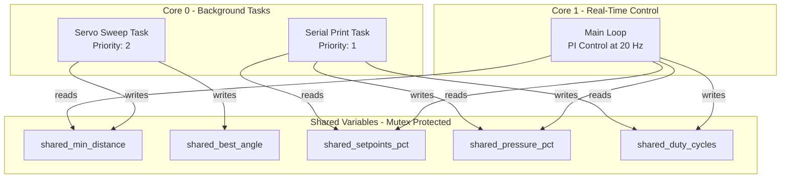
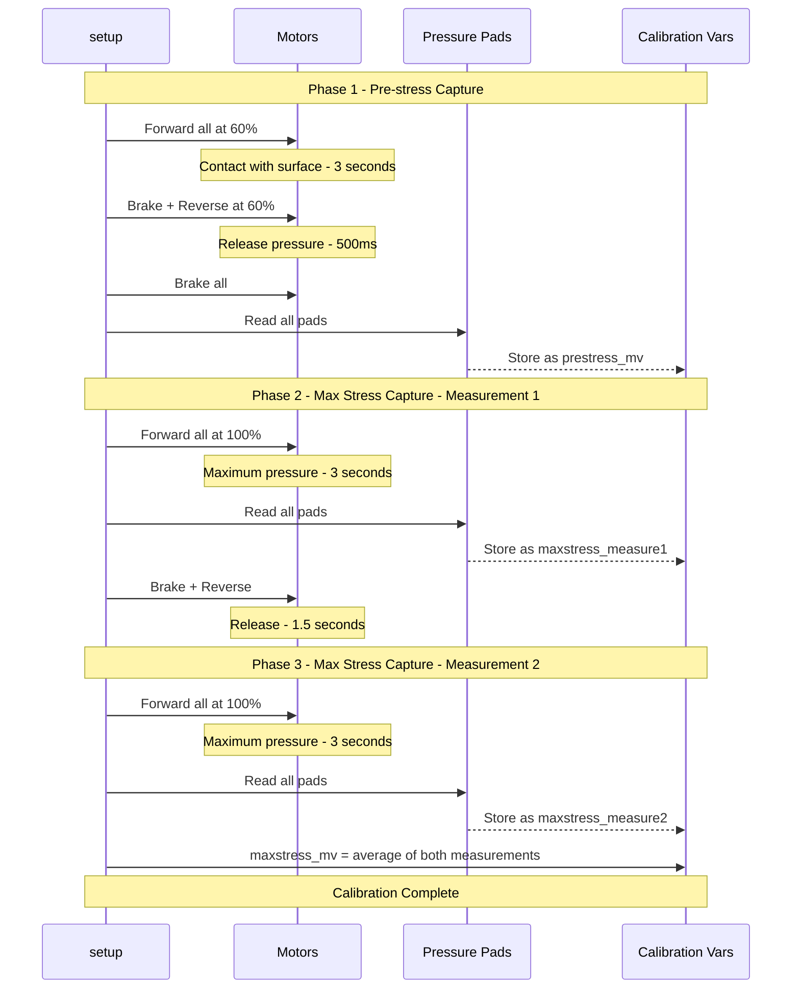
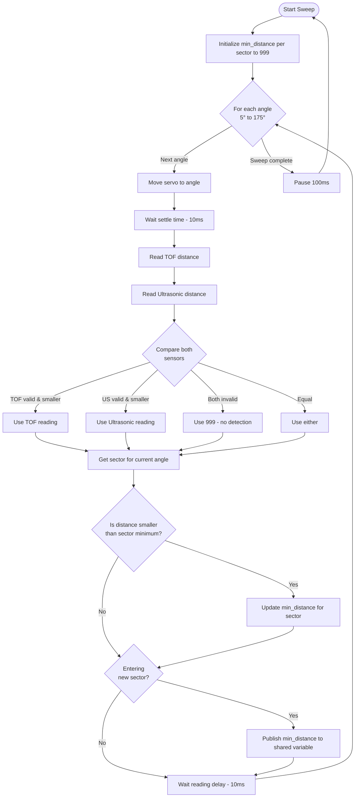
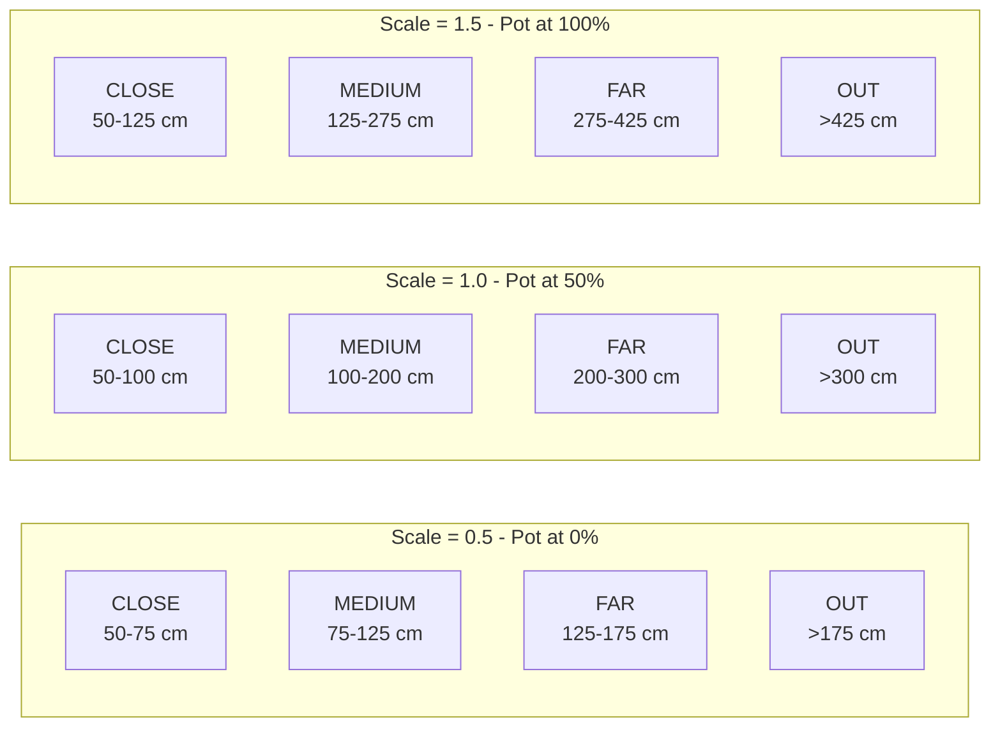
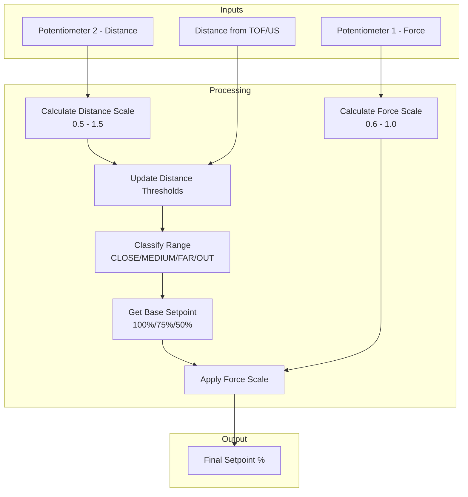
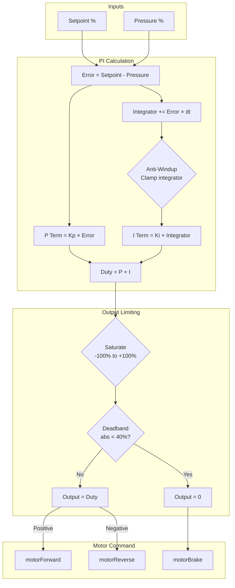
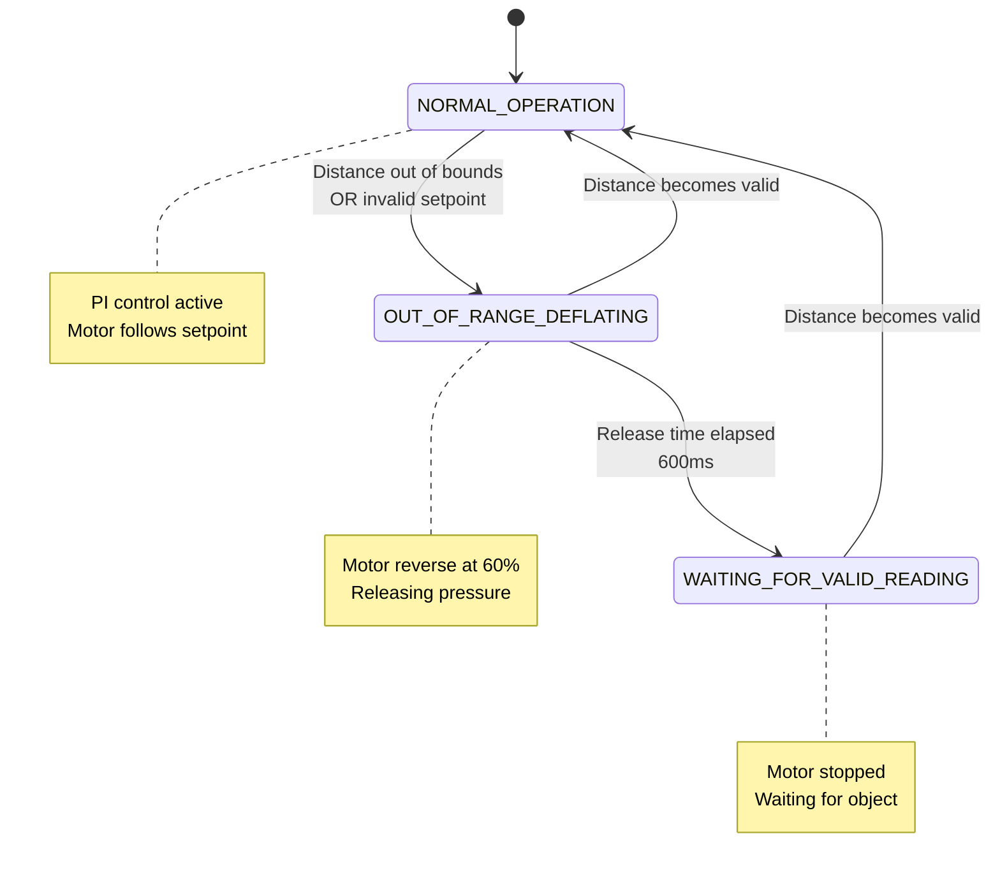
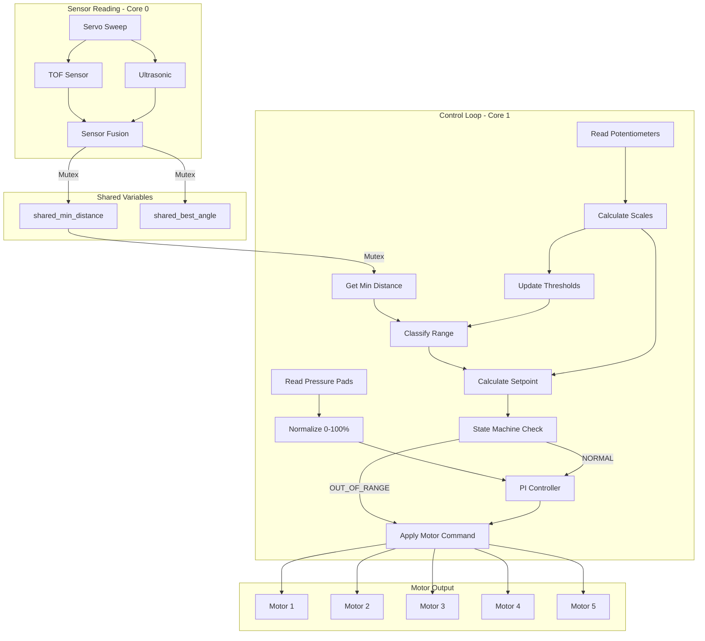

# System Logic - Detailed Documentation

This document provides a comprehensive explanation of the 5-Motor Independent PI Control System with Dynamic TOF Setpoint.

## Table of Contents

1. [System Overview](#system-overview)
2. [Hardware Architecture](#hardware-architecture)
3. [Software Architecture](#software-architecture)
4. [Dual-Core Task Distribution](#dual-core-task-distribution)
5. [Calibration Process](#calibration-process)
6. [Servo Sweep and Distance Detection](#servo-sweep-and-distance-detection)
7. [Distance Range Classification](#distance-range-classification)
8. [Potentiometer Scaling System](#potentiometer-scaling-system)
9. [Setpoint Calculation](#setpoint-calculation)
10. [PI Control Algorithm](#pi-control-algorithm)
11. [State Machine for Out-of-Range Handling](#state-machine-for-out-of-range-handling)
12. [Data Flow Diagrams](#data-flow-diagrams)
13. [Timing and Performance](#timing-and-performance)

---

## System Overview

The system implements **independent closed-loop pressure control** for 5 motors, where each motor maintains a target pressure on a pressure pad. The target pressure (setpoint) is dynamically determined by the distance of an object detected by TOF and ultrasonic sensors mounted on a sweeping servo.

### Key Features

- **5 Independent PI Controllers**: Each motor has its own control loop
- **Dynamic Setpoint**: Pressure targets change based on detected distance
- **Sector-Based Detection**: Servo sweep divided into 5 sectors, one per motor
- **Dual-Core Architecture**: Real-time control on Core 1, sensing/logging on Core 0
- **Potentiometer Adjustment**: Force and distance ranges adjustable in real-time
- **Safety State Machine**: Automatic deflation when object leaves valid range

---

## Hardware Architecture

### Component Summary

| Component | Quantity | Purpose |
|-----------|----------|---------|
| ESP32-S3 | 1 | Dual-core microcontroller |
| DC Motors | 5 | Apply pressure via mechanism |
| H-Bridge Drivers | 5 | Bidirectional motor control |
| Pressure Pads | 5 | Measure applied force |
| TOF Sensor | 1 | Distance measurement |
| Ultrasonic Sensor | 1 | Secondary distance measurement |
| Servo Motor | 1 | Sweep sensors across field |
| CD74HC4067 Multiplexer | 1 | Route analog signals |
| Potentiometers | 2 | Adjust force and distance scales |

### Pin Configuration

```
Motors:
├── Motor 1: PWM=14, IN1=13, IN2=21
├── Motor 2: PWM=35, IN1=48, IN2=47
├── Motor 3: PWM=36, IN1=37, IN2=38
├── Motor 4: PWM=41, IN1=39, IN2=40
└── Motor 5: PWM=42, IN1=1,  IN2=2

Sensors:
├── TOF: RX=10, TX=11 (921600 baud)
├── Servo: PWM=6 (50 Hz)
└── Multiplexer: S0=17, S1=16, S2=15, S3=7, SIG=4

Multiplexer Channels:
├── Pressure Pads: CH5, CH4, CH3, CH2, CH1
└── Potentiometers: CH12, CH14
```

---

## Software Architecture

### Module Structure

```
src/
├── main.cpp                    # Main loop, PI control orchestration
├── config/
│   ├── pins.h                  # Hardware pin definitions
│   ├── system_config.h         # System mode configuration
│   └── servo_config.h          # Servo sweep parameters
├── sensors/
│   ├── tof_sensor.cpp/h        # TOF + servo sweep logic
│   ├── ultrasonic_sensor.cpp/h # Ultrasonic distance
│   └── pressure_pads.cpp/h     # Pressure pad reading
├── actuators/
│   └── motors.cpp/h            # Motor control functions
├── control/
│   └── pi_controller.cpp/h     # PI algorithm implementation
├── tasks/
│   └── core0_tasks.cpp/h       # FreeRTOS tasks for Core 0
└── utils/
    ├── multiplexer.cpp/h       # Analog multiplexer control
    ├── binary_protocol.cpp/h   # Serial communication protocol
    └── command_handler.cpp/h   # Runtime configuration
```

---

## Dual-Core Task Distribution

The ESP32-S3 dual-core architecture is leveraged for real-time performance:



### Core 0 Tasks

| Task | Priority | Stack | Function |
|------|----------|-------|----------|
| ServoSweep | 2 (Higher) | 4096 bytes | Continuous servo sweep, TOF/ultrasonic reading |
| SerialPrint | 1 (Lower) | 4096 bytes | Binary data logging at configured rate |

### Core 1 Task

| Task | Frequency | Function |
|------|-----------|----------|
| Main Loop | 20 Hz (50ms) | Pressure reading, PI control, motor commands |

---

## Calibration Process

At startup, the system performs automatic calibration to determine the operating range for each pressure pad.



### Calibration Values

- **prestress_mv[i]**: Baseline reading when pad is at rest (0% normalized)
- **maxstress_mv[i]**: Maximum reading at 100% PWM (used for 100% normalized)
- **Effective range**: `prestress_mv` to `maxstress_mv * 0.95` (5% safety margin)

### Pressure Normalization Formula

```cpp
float mapPressureToPercent(int motor_index, uint16_t mv_reading) {
    float min_val = prestress_mv[motor_index];
    float max_val = maxstress_mv[motor_index] * 0.95f;  // 95% of max

    float normalized = (mv_reading - min_val) / (max_val - min_val) * 100.0f;
    return constrain(normalized, 0.0f, 100.0f);
}
```

---

## Servo Sweep and Distance Detection

The servo continuously sweeps the TOF and ultrasonic sensors across the field of view, divided into 5 sectors (one per motor).

### Sector Configuration

```
Servo Sweep Range: 5° to 175° (170° total)
Step Size: 3°
Total Steps: 57 steps per sweep

Sector Assignment:
┌─────────┬─────────┬─────────┬─────────┬─────────┐
│ Motor 1 │ Motor 2 │ Motor 3 │ Motor 4 │ Motor 5 │
│  5°-39° │ 39°-73° │73°-107° │107°-141°│141°-175°│
│ Center: │ Center: │ Center: │ Center: │ Center: │
│   22°   │   56°   │   90°   │  124°   │  158°   │
└─────────┴─────────┴─────────┴─────────┴─────────┘
```

### Sweep Algorithm



### Sensor Fusion Logic

```cpp
// Priority: Use smallest valid distance from either sensor
if (!tof_valid && !us_valid) {
    distance = 999.0f;  // No valid reading
    active_sensor = SENSOR_NONE;
} else if (!tof_valid) {
    distance = ultrasonic_distance;
    active_sensor = SENSOR_ULTRASONIC;
} else if (!us_valid) {
    distance = tof_distance;
    active_sensor = SENSOR_TOF;
} else if (tof_distance < ultrasonic_distance) {
    distance = tof_distance;
    active_sensor = SENSOR_TOF;
} else {
    distance = ultrasonic_distance;
    active_sensor = SENSOR_ULTRASONIC;
}
```

---

## Distance Range Classification

Detected distances are classified into ranges that determine the pressure setpoint.

### Range Definitions (Base Values at Scale = 1.0)

| Range | Distance (cm) | Setpoint | Behavior |
|-------|---------------|----------|----------|
| CLOSE | 50 - 100 | 100% | Maximum pressure |
| MEDIUM | 100 - 200 | 75% | Medium pressure |
| FAR | 200 - 300 | 50% | Light pressure |
| OUT_OF_BOUNDS | <50 or >300 | N/A | Safety deflation |
| UNKNOWN | Error/Invalid | N/A | Motor stopped |

### Dynamic Threshold Adjustment

Potentiometer 2 adjusts all distance thresholds (except the minimum 50cm):

```cpp
// Scale ranges from 0.5 (pot at 0%) to 1.5 (pot at 100%)
// Formula: threshold = 50 + (base - 50) * scale

distance_close_max = 50 + (100 - 50) * scale;   // 75-125 cm
distance_medium_max = 50 + (200 - 50) * scale;  // 125-275 cm
distance_far_max = 50 + (300 - 50) * scale;     // 150-450 cm
```



---

## Potentiometer Scaling System

Two potentiometers provide real-time adjustment of system behavior.

### Potentiometer 1: Force Scale

Controls the magnitude of pressure setpoints.

```cpp
// Scale ranges from 0.60 (pot at 0%) to 1.00 (pot at 100%)
float calculateForceScale(uint16_t pot_mv) {
    float pot_normalized = pot_mv / 3300.0f;  // 0-1 range
    return 0.60f + pot_normalized * (1.00f - 0.60f);
}
```

| Pot Position | Force Scale | CLOSE Setpoint | MEDIUM Setpoint | FAR Setpoint |
|--------------|-------------|----------------|-----------------|--------------|
| 0% (0 mV) | 0.60 | 60% | 45% | 30% |
| 50% (1650 mV) | 0.80 | 80% | 60% | 40% |
| 100% (3300 mV) | 1.00 | 100% | 75% | 50% |

### Potentiometer 2: Distance Scale

Controls the distance thresholds for range classification.

```cpp
// Scale ranges from 0.50 (pot at 0%) to 1.50 (pot at 100%)
float calculateDistanceScale(uint16_t pot_mv) {
    float pot_normalized = pot_mv / 3300.0f;  // 0-1 range
    return 0.50f + pot_normalized * (1.50f - 0.50f);
}
```

| Pot Position | Distance Scale | FAR Max Boundary |
|--------------|----------------|------------------|
| 0% (0 mV) | 0.50 | 175 cm |
| 50% (1650 mV) | 1.00 | 300 cm |
| 100% (3300 mV) | 1.50 | 425 cm |

---

## Setpoint Calculation

The final setpoint for each motor is calculated by combining range-based setpoints with potentiometer scaling.



### Setpoint Calculation Code

```cpp
// Step 1: Get base setpoint from range
float base_setpoint = calculateSetpoint(current_range[i], 0.0f);

// Step 2: Apply force scale from potentiometer 1
if (base_setpoint > 0.0f) {
    setpoints[i] = base_setpoint * force_scale;
} else {
    setpoints[i] = base_setpoint;  // Keep invalid setpoint as-is
}
```

---

## PI Control Algorithm

Each motor uses an independent PI controller with anti-windup protection.

### PI Controller Parameters

| Parameter | Value | Description |
|-----------|-------|-------------|
| Kp | 1.0 | Proportional gain |
| Ki | 4.0 | Integral gain |
| Control Frequency | 20 Hz | 50ms period |
| Duty Min/Max | -100% / +100% | Output limits |
| Deadband (MIN_RUN) | 40% | Minimum duty to overcome friction |

### PI Algorithm



### Anti-Windup Implementation

```cpp
// Clamp integrator to prevent excessive accumulation
float integrator_max = DUTY_MAX / max(Ki, 0.0001f);
integrators[i] = constrain(integrators[i], -integrator_max, integrator_max);
```

### Deadband Logic

```cpp
if (duty >= MIN_RUN) {
    command = duty;           // Forward
} else if (duty <= -MIN_RUN) {
    command = duty;           // Reverse
} else {
    command = 0.0f;           // Stop - within deadband
}
```

---

## State Machine for Out-of-Range Handling

When the detected distance goes out of valid range, a per-motor state machine ensures safe deflation.

### States

| State | Description | Motor Action |
|-------|-------------|--------------|
| NORMAL_OPERATION | Valid distance, PI control active | PI-controlled |
| OUT_OF_RANGE_DEFLATING | Actively releasing pressure | Reverse at 60% |
| WAITING_FOR_VALID_READING | Waiting for object to return | Brake (stopped) |

### State Machine Diagram



### State Transition Code

```cpp
switch (current_state[motor_index]) {
    case NORMAL_OPERATION:
        if (is_out_of_bounds) {
            current_state[motor_index] = OUT_OF_RANGE_DEFLATING;
            reverse_start_time[motor_index] = current_time;
            duty_cycles[motor_index] = -REVERSE_DUTY_PCT;  // -60%
        }
        break;

    case OUT_OF_RANGE_DEFLATING:
        if (is_valid) {
            // Object returned - resume normal operation
            current_state[motor_index] = NORMAL_OPERATION;
        } else if (current_time - reverse_start_time[motor_index] >= RELEASE_TIME_MS) {
            // Release time elapsed - stop and wait
            current_state[motor_index] = WAITING_FOR_VALID_READING;
            duty_cycles[motor_index] = 0.0f;
        }
        break;

    case WAITING_FOR_VALID_READING:
        if (is_valid) {
            current_state[motor_index] = NORMAL_OPERATION;
        }
        break;
}
```

---

## Data Flow Diagrams

### Complete Control Loop Data Flow



### Main Loop Sequence (One Iteration)

```mermaid
sequenceDiagram
    participant Loop as Main Loop
    participant Pads as Pressure Pads
    participant Pots as Potentiometers
    participant TOF as TOF Module
    participant PI as PI Controller
    participant Motors as Motors

    Note over Loop,Motors: Every 50ms at 20 Hz

    Loop->>Pads: readAllPadsMilliVolts
    Pads-->>Loop: pressure_pads_mv[5]
    Loop->>Loop: mapPressureToPercent - Normalize to 0-100%

    Loop->>Pots: readMuxMilliVoltsAveraged
    Pots-->>Loop: potentiometer_mv[2]
    Loop->>Loop: calculateForceScale
    Loop->>Loop: calculateDistanceScale
    Loop->>Loop: Update distance thresholds

    loop For each motor 0-4
        Loop->>TOF: getMinDistance for motor sector
        TOF-->>Loop: min_distance_cm
        Loop->>Loop: getDistanceRange - Classify
        Loop->>Loop: calculateSetpoint × force_scale
        Loop->>Loop: State machine check
    end

    Loop->>PI: controlStepNormalized - setpoints, pressures
    PI->>Motors: motorForward/Reverse/Brake

    Loop->>Loop: Update shared variables for logging
```

---

## Timing and Performance

### Timing Budget

| Operation | Time | Frequency |
|-----------|------|-----------|
| Control Loop | 50 ms | 20 Hz |
| Servo Step | 10 ms settle + 10 ms delay | ~50 steps/sec |
| Full Sweep | ~1.2 seconds | ~0.8 Hz |
| Binary Logging | 20 ms | 50 Hz |
| ADC Reading (8 samples) | ~1 ms | Per channel |

### Sweep Performance

```
Total Sweep Range: 170° (5° to 175°)
Step Size: 3°
Total Steps: 57
Time per Step: 20ms (10ms settle + 10ms delay)
Sweep Time: ~1.14 seconds (1140ms)
Sweep Frequency: ~0.88 Hz
```

### Memory Usage (Typical)

```
RAM:   ~22 KB / 328 KB (6.8%)
Flash: ~300 KB / 1.3 MB (22.9%)
```

### Communication Bandwidth

Binary Protocol: 70 bytes/packet × 50 Hz = 3500 bytes/second

---

## Configuration Summary

### Build-Time Configuration (system_config.h)

| Option | Values | Current |
|--------|--------|---------|
| Control Mode | NEWTONS / MILLIVOLTS | MILLIVOLTS |
| Protocol | BINARY / Debug | BINARY |
| Logging Rate | 10/25/50/100 Hz | 50 Hz |
| Sweep Mode | FORWARD / BIDIRECTIONAL | FORWARD |

### Run-Time Configuration (via Serial Commands)

- Sweep enable/disable
- Manual servo angle
- Sweep parameters (min, max, step, settle, delay)
- PI gains (Kp, Ki)

---

## Quick Reference

### Setpoint Values (Base)

| Range | Distance | Base Setpoint |
|-------|----------|---------------|
| CLOSE | 50-100 cm | 100% |
| MEDIUM | 100-200 cm | 75% |
| FAR | 200-300 cm | 50% |

### Potentiometer Ranges

| Pot | Function | Min (0%) | Max (100%) |
|-----|----------|----------|------------|
| Pot 1 | Force Scale | 0.60 | 1.00 |
| Pot 2 | Distance Scale | 0.50 | 1.50 |

### PI Controller

| Parameter | Value |
|-----------|-------|
| Kp | 1.0 |
| Ki | 4.0 |
| Deadband | 40% |
| Output Range | -100% to +100% |

---

*Last Updated: 2025*
*Version: 1.0*
