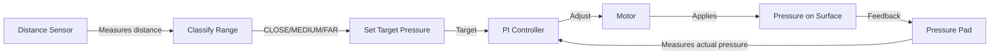
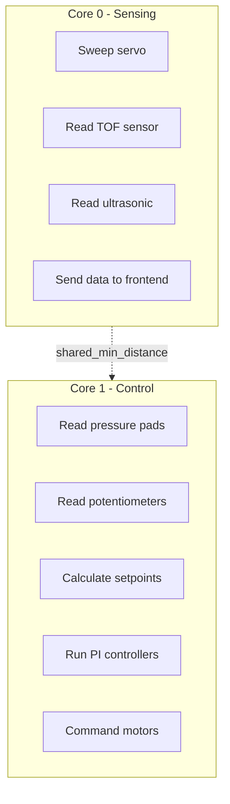
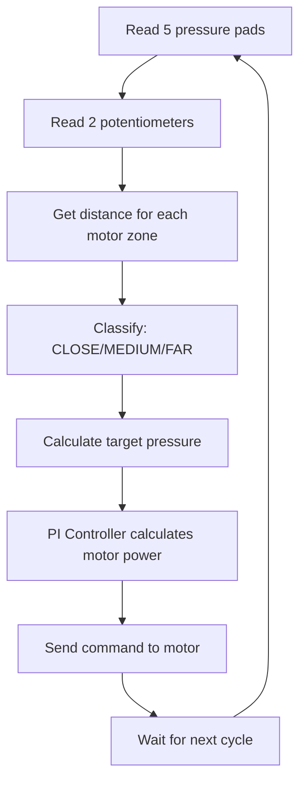
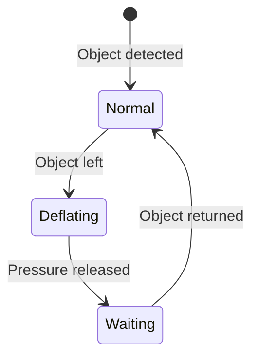

# System Logic - Simple Overview

A simplified explanation of the 5-Motor Pressure Control System.

---

## What Does This System Do?

This system controls **5 motors** that apply pressure to a surface. The amount of pressure depends on **how far away an object is** from a distance sensor.

- **Object close** → Apply more pressure
- **Object far** → Apply less pressure
- **Object gone** → Release pressure safely

---

## Main Components

```
┌─────────────────────────────────────────────────────────┐
│                      ESP32-S3                           │
│                                                         │
│   ┌─────────┐     ┌─────────────┐     ┌─────────────┐  │
│   │  Core 0 │     │   Core 1    │     │   Shared    │  │
│   │ Sensing │◄───►│   Control   │◄───►│  Variables  │  │
│   └─────────┘     └─────────────┘     └─────────────┘  │
└─────────────────────────────────────────────────────────┘
        │                   │
        ▼                   ▼
┌───────────────┐   ┌───────────────┐
│   Sensors     │   │    Motors     │
│ - TOF         │   │   5 motors    │
│ - Ultrasonic  │   │   with        │
│ - Servo sweep │   │   H-bridges   │
│ - Pres. pads  │   │               │
│ - Pots        │   │               │
└───────────────┘   └───────────────┘
```

---

## How It Works - The Big Picture



### Step by Step:

1. **Servo sweeps** the TOF sensor across 5 zones (one per motor)
2. **Distance is measured** for each zone
3. **Range is classified**: CLOSE, MEDIUM, or FAR
4. **Target pressure is set** based on the range
5. **Pressure pad reads** actual pressure
6. **PI controller calculates** motor command
7. **Motor adjusts** to reach target pressure
8. **Loop repeats** at 20 Hz (50ms)

---

## The Three Distance Ranges

| Range | Distance | Target Pressure | Meaning |
|-------|----------|-----------------|---------|
| **CLOSE** | 50-100 cm | 100% | Object is close, apply full pressure |
| **MEDIUM** | 100-200 cm | 75% | Object at medium distance |
| **FAR** | 200-300 cm | 50% | Object far away, light touch |
| **OUT** | <50 or >300 cm | 0% | Safety mode, release pressure |

---

## The Two Potentiometers

### Potentiometer 1: Force Adjustment

Controls **how much pressure** to apply.

```
Turn LEFT  (0%)   → Gentle: 60% of normal pressure
Turn RIGHT (100%) → Full:   100% of normal pressure
```

### Potentiometer 2: Distance Adjustment

Controls **at what distances** the ranges change.

```
Turn LEFT  (0%)   → Shorter ranges (FAR ends at 175 cm)
Turn RIGHT (100%) → Longer ranges (FAR ends at 425 cm)
```

---

## Dual-Core Architecture

The ESP32 has two processor cores working in parallel:



**Why two cores?**
- Core 0 handles slow tasks (servo movement, sensor reading)
- Core 1 handles fast tasks (control loop at 20 Hz)
- They don't block each other

---

## The Control Loop (20 Hz)

Every 50 milliseconds, Core 1 does:



---

## Calibration at Startup

Before the system starts controlling, it learns the pressure range:


This calibration means:
- **0%** = the pressure when motors are released
- **100%** = the pressure when motors push at full power

---

## Safety: Out-of-Range Handling

When an object leaves the valid distance range:



1. **Normal**: PI control is active
2. **Deflating**: Motor reverses to release pressure (600ms)
3. **Waiting**: Motor stopped, waiting for object to return

---

## Key Numbers

| Parameter | Value |
|-----------|-------|
| Control frequency | 20 Hz (every 50ms) |
| Number of motors | 5 |
| Servo sweep range | 5° to 175° |
| Servo step size | 3° |
| Full sweep time | ~1.2 seconds |
| PI proportional gain (Kp) | 1.0 |
| PI integral gain (Ki) | 4.0 |
| Motor deadband | 40% |

---

## Sector Assignment

Each motor controls one angular sector:

```
        Motor 1    Motor 2    Motor 3    Motor 4    Motor 5
           │          │          │          │          │
           ▼          ▼          ▼          ▼          ▼
      ┌────────┬────────┬────────┬────────┬────────┐
      │  5°-   │  39°-  │  73°-  │ 107°-  │ 141°-  │
      │  39°   │  73°   │ 107°   │ 141°   │ 175°   │
      └────────┴────────┴────────┴────────┴────────┘
                    Servo Sweep Arc
```

Each motor only responds to objects detected in its sector.

---

## Quick Summary

```
┌─────────────────────────────────────────────────────────┐
│                  SYSTEM OPERATION                       │
├─────────────────────────────────────────────────────────┤
│                                                         │
│  1. Servo sweeps TOF sensor across 5 zones              │
│                        ↓                                │
│  2. Distance measured for each motor's zone             │
│                        ↓                                │
│  3. Distance → Range → Target Pressure                  │
│     - Close (50-100cm)  → 100%                          │
│     - Medium (100-200cm) → 75%                          │
│     - Far (200-300cm)   → 50%                           │
│                        ↓                                │
│  4. Potentiometers adjust force and distance ranges     │
│                        ↓                                │
│  5. PI controller adjusts motor to reach target         │
│                        ↓                                │
│  6. Repeat at 20 Hz                                     │
│                                                         │
└─────────────────────────────────────────────────────────┘
```

---

## Files Reference

| File | Purpose |
|------|---------|
| `src/main.cpp` | Main control loop |
| `src/sensors/tof_sensor.cpp` | TOF sensor and servo sweep |
| `src/control/pi_controller.cpp` | PI algorithm |
| `src/actuators/motors.cpp` | Motor control |
| `src/config/pins.h` | Pin assignments |
| `src/config/servo_config.h` | Servo parameters |

---

*For more details, see [SYSTEM_LOGIC_DETAILED.md](SYSTEM_LOGIC_DETAILED.md)*
