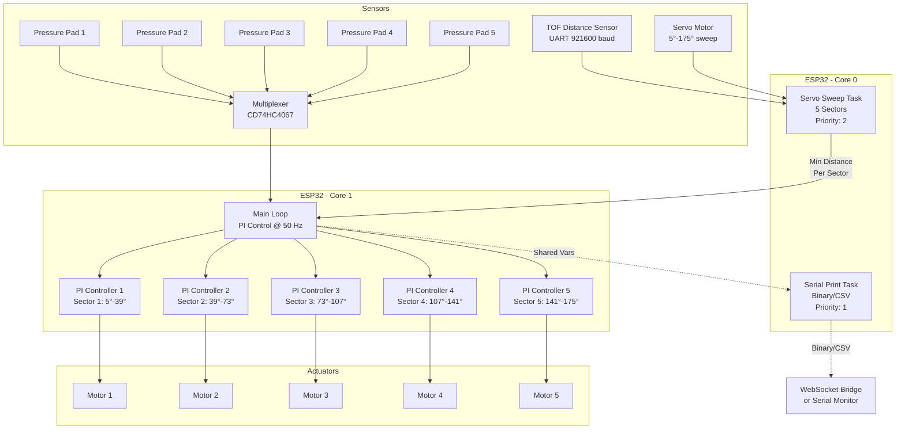
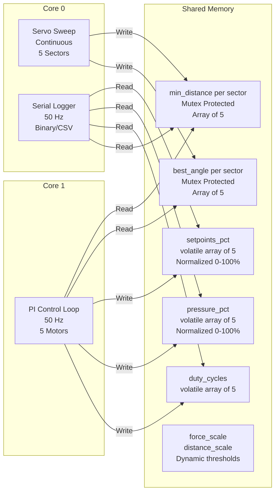
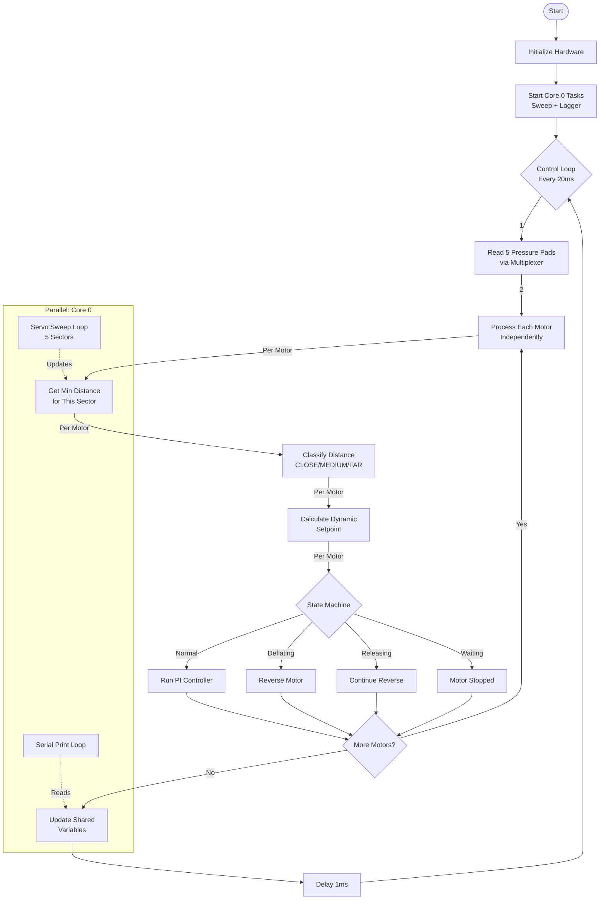
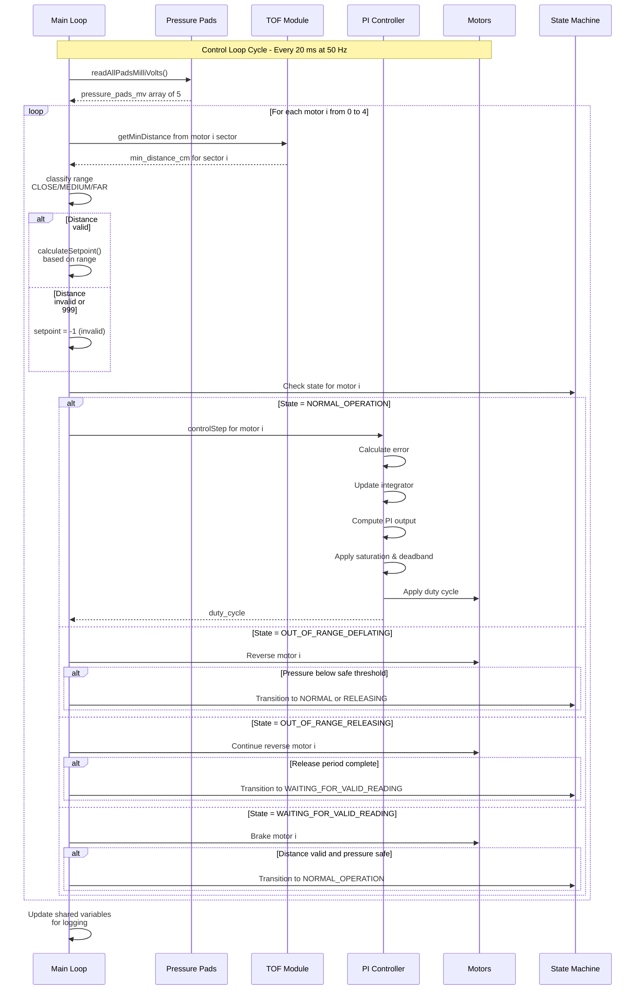
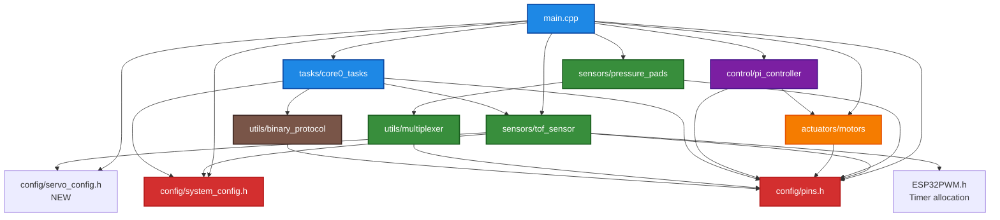
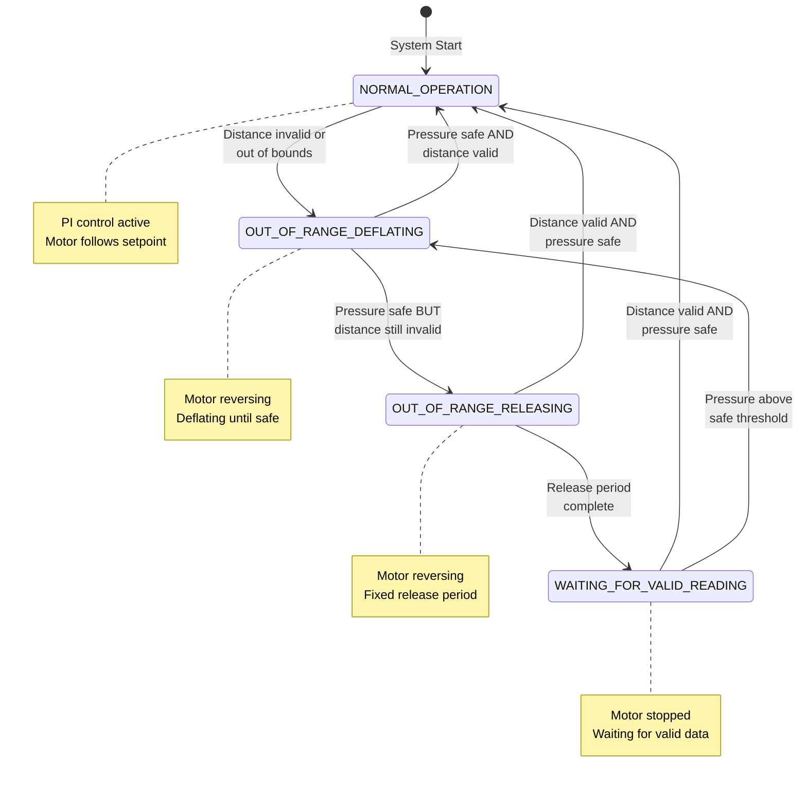
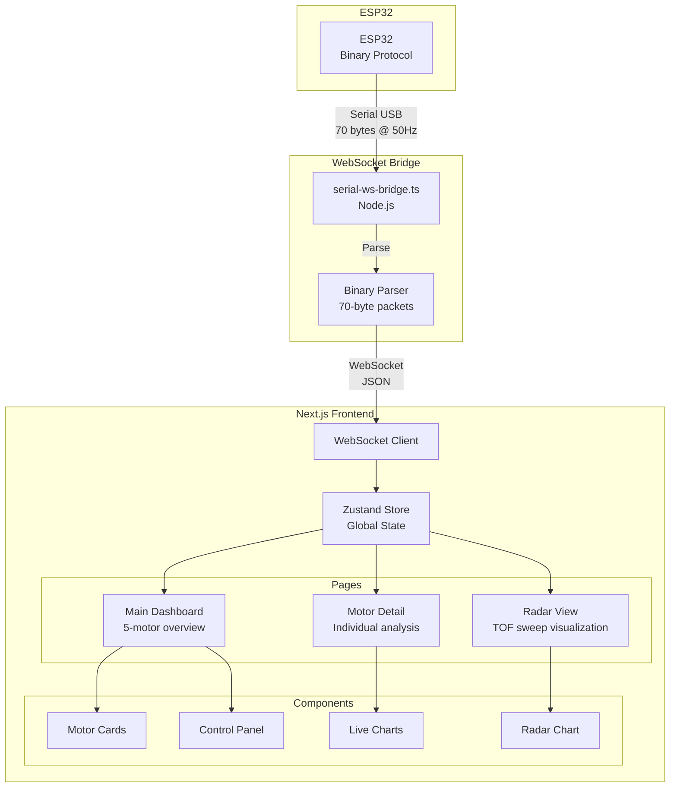

# System Architecture

This document describes the overall system architecture, data flow, and module interactions for the 5-Motor Independent PI Control System with servo sweep TOF sensing.

## Table of Contents

1. [System Overview](#system-overview)
2. [Multi-Core Architecture](#multi-core-architecture)
3. [Data Flow](#data-flow)
4. [Module Dependencies](#module-dependencies)
5. [Control Loop Timing](#control-loop-timing)

---

## System Overview

The system uses an ESP32 dual-core microcontroller to manage:
- **5 independent motors** with PI control
- **5 pressure pad sensors** for feedback
- **1 TOF distance sensor** with servo sweep (5°-175° divided into 5 sectors)
- **Configurable sweep modes** (forward-only or bidirectional)
- **Real-time data logging** via Serial (Binary or CSV protocol)
- **Web dashboard** with real-time visualization and dynamic configuration loading



---

## Multi-Core Architecture

The ESP32's dual cores are utilized to separate time-critical control from data acquisition and logging.

### Core 0: Data Acquisition & Logging

**Tasks:**
1. **Servo Sweep Task** (Priority 2)
   - Sweeps servo from 5° to 175° in 3° steps
   - Supports two sweep modes (configured in servo_config.h):
     - **SWEEP_MODE_FORWARD**: Continuous forward sweep (5°→175°, reset to 5°)
     - **SWEEP_MODE_BIDIRECTIONAL**: Forward and backward sweep (5°→175°→5°)
   - Reads TOF distance at each angle
   - Tracks minimum distance independently for 5 sectors:
     - Sector 1 (Motor 1): 5° - 39° (34° range)
     - Sector 2 (Motor 2): 39° - 73° (34° range)
     - Sector 3 (Motor 3): 73° - 107° (34° range)
     - Sector 4 (Motor 4): 107° - 141° (34° range)
     - Sector 5 (Motor 5): 141° - 175° (34° range)
   - Updates shared variables (mutex-protected) when each sector completes
   - Handles sector completion correctly even when SERVO_STEP doesn't align with sector boundaries
   - Runs continuously

2. **Serial Print Task** (Priority 1)
   - Reads shared variables from Core 1
   - Outputs binary (115 bytes) or CSV data at configurable rate (10-100 Hz)
   - Includes potentiometer values and dynamic distance thresholds
   - Lower priority to not interfere with sweep
   - Sends to WebSocket bridge or serial monitor

### Core 1: Real-Time Control

**Main Loop:**
- Runs at exactly 50 Hz (20 ms period)
- For each motor independently:
  - Reads minimum distance from its sector (from Core 0)
  - Reads pressure pad via multiplexer (normalized to 0-100%)
  - Reads potentiometer values for force and distance scaling
  - Classifies distance into range (CLOSE/MEDIUM/FAR) using dynamic thresholds
  - Calculates dynamic setpoint based on range (normalized percentage)
  - Executes PI controller
  - Manages safety state machine
  - Applies motor command
- Updates shared variables for logging (including scale values and thresholds)



---

## Data Flow

### High-Level Data Flow



### Detailed Control Step (Core 1)



---

## Module Dependencies



### Module Descriptions

| Module | Purpose | Dependencies |
|--------|---------|--------------|
| **main.cpp** | System orchestration, 5-motor control loop | All modules |
| **config/pins.h** | Pin definitions | None (base) |
| **config/system_config.h** | Protocol and logging configuration | None (base) |
| **config/servo_config.h** | Servo sweep configuration (NEW) | None (base) |
| **sensors/tof_sensor** | TOF reading, servo sweep (5 sectors) | pins.h, system_config.h, servo_config.h, ESP32PWM |
| **sensors/pressure_pads** | Pressure pad reading (5 pads) | pins.h, multiplexer |
| **utils/multiplexer** | Analog multiplexer control | pins.h |
| **actuators/motors** | Motor PWM control (5 motors) | pins.h |
| **control/pi_controller** | PI algorithm for 5 motors | pins.h, motors |
| **tasks/core0_tasks** | FreeRTOS tasks for Core 0 | pins.h, tof_sensor, binary_protocol |
| **utils/binary_protocol** | Binary packet encoding/decoding | pins.h |

---

## Control Loop Timing

### Timing Diagram

**One Control Cycle (20 ms):**

| Time (ms) | Core 1 - Control Loop | Core 0 - Sweep Task | Core 0 - Logger Task |
|-----------|----------------------|---------------------|----------------------|
| 0-3 | Read 5 Pressure Pads | TOF Reading | Read Shared Vars |
| 3-5 | Motor 1 Processing | TOF Reading (cont.) | Binary Encode/CSV |
| 5-7 | Motor 2 Processing | Move Servo | Serial Transmit |
| 7-9 | Motor 3 Processing | Move Servo (cont.) | Waiting |
| 9-11 | Motor 4 Processing | TOF Reading | Waiting |
| 11-12 | Update Shared Vars | TOF Reading (cont.) | Waiting |
| 12-20 | Idle Time | TOF Reading (cont.) | Waiting |

**Notes:**
- Core 1 completes control loop in ~12 ms, leaving 8 ms idle time
- Core 0 Sweep Task runs continuously, taking TOF readings at each servo angle
- Core 0 Logger Task transmits data in ~5 ms, then waits for next period

### Timing Specifications

| Task | Frequency | Period | Execution Time | Core |
|------|-----------|--------|----------------|------|
| PI Control Loop (5 motors) | 50 Hz | 20 ms | ~10-12 ms | Core 1 |
| Servo Sweep (5°-175°) | Continuous | ~10-12 s per full sweep | Variable | Core 0 |
| Serial Logger | 10-100 Hz | 10-100 ms | ~3-5 ms | Core 0 |
| Pressure Pad Read (5 pads) | 50 Hz | 20 ms | ~3-4 ms | Core 1 |
| TOF Single Read | Variable | N/A | ~50-100 ms | Core 0 |
| Sector Update | ~5× per sweep | ~2.5-3 s | Immediate | Core 0 |

### Critical Timing Constraints

1. **PI Control Must Run at 50 Hz**
   - Ensures stable control loop
   - Deadlines must be met to avoid jitter
   - Max execution time: <20 ms

2. **Mutex Access Must Be Fast**
   - Timeout: 10 ms maximum
   - Prevents blocking between cores
   - Ensures real-time responsiveness

3. **Multiplexer Settling Time**
   - 100 µs after channel switch
   - Required for accurate readings
   - Additional 50 µs between samples

4. **Servo Settling Time**
   - 80 ms per angle step
   - Allows mechanical stabilization
   - Critical for accurate TOF readings

5. **Sector Completion Updates**
   - Immediate update when sector completes
   - Mutex-protected write from Core 0
   - Non-blocking read from Core 1

---

## Safety State Machine (Per Motor)

Each motor operates independently with its own state machine:



---

## Web Dashboard Architecture

The system includes a real-time web dashboard built with Next.js and React for live visualization of all system data.

### Frontend Components



### Dashboard Features

**Main Dashboard (`/`):**
- Overview of all 5 motors simultaneously
- Live metrics: pressure (mV), duty cycle (%), distance (cm), setpoint (mV)
- Connection status and controls (connect, disconnect, record, pause)
- Real-time updates at logging rate (10-100 Hz)


**Motor Detail View (`/motor/[id]`):**
- Individual motor analysis with historical charts
- Pressure vs time, duty cycle vs time, distance vs time
- Rolling 10-second window for trend analysis
- State machine status display


**Radar Visualization (`/radar`):**
- Live TOF sweep visualization (5°-175° dynamic range)
- 5 sectors color-coded by motor (boundaries loaded from backend)
- Real-time servo angle indicator
- Current distance reading per sector
- Polar coordinate display
- Sector statistics (min distance, best angle)
- Dynamically adapts to servo configuration changes


### Data Flow: ESP32 to Frontend

1. **ESP32 Core 0** - Serial Print Task outputs binary packets (115 bytes) at configured logging rate
2. **WebSocket Bridge** - Node.js server reads serial port, parses binary protocol
3. **WebSocket** - JSON data broadcast to connected clients
4. **Frontend Store** - Zustand state management updates component data
5. **React Components** - Re-render with latest values (optimized with useMemo)

### Binary Protocol Structure (115 bytes)

```
[0-1]     Header: 0xAA 0x55 (synchronization)
[2-5]     Timestamp (uint32_t milliseconds)
[6-25]    Setpoints: 5× float (percentage 0-100%)
[26-45]   Pressure Pads: 5× float (normalized 0-100%)
[46-65]   Duty Cycles: 5× float (-100 to +100%)
[66-85]   TOF Distances: 5× float (cm per sector)
[86]      Servo Angle (uint8_t, 0-175°)
[87-90]   Current TOF Reading: float (live distance at servo angle)
[91]      Mode Byte (uint8_t, always 1 for sweep mode)
[92]      Active Sensor (uint8_t: 0=none, 1=TOF, 2=ultrasonic, 3=both)
[93-96]   Force Scale: float (0.6-1.0 from potentiometer 1)
[97-100]  Distance Scale: float (0.5-1.5 from potentiometer 2)
[101-104] CLOSE/MEDIUM boundary: float (75-125 cm)
[105-108] MEDIUM/FAR boundary: float (125-275 cm)
[109-112] FAR/OUT boundary: float (150-450 cm)
[113-114] CRC-16 checksum
```

**Key Features:**
- All pressure/setpoint values are **normalized (0-100%)** based on calibration
- Dynamic distance thresholds adjustable via potentiometers
- CRC-16 error detection for data integrity
- 3-5x faster parsing than CSV format

---

## Summary

The architecture leverages the ESP32's dual cores to achieve:
- **Real-time control** at 50 Hz on Core 1 for 5 independent motors
- **Parallel data acquisition** on Core 0 with configurable servo sweep modes (forward/bidirectional) and sector-based distance tracking (5°-175° range)
- **Thread-safe communication** via mutex-protected shared variables
- **Modular design** for easy maintenance and extension with separate configuration files
- **Independent motor control** with per-motor state machines and setpoints
- **Normalized pressure values** (0-100%) based on calibrated prestress and maxstress
- **Potentiometer-controlled scaling** for force (0.6-1.0) and distance (0.5-1.5)
- **Dynamic distance thresholds** adjustable via potentiometers
- **Flexible output** supporting both binary (115-byte packets) and CSV protocols
- **Web dashboard** with real-time visualization, historical charts, and adaptive radar display
- **WebSocket bridge** for seamless ESP32-to-browser communication
- **Dynamic configuration loading** from ESP32 source files to frontend (no hardcoded values)

This design ensures deterministic control loop timing while maintaining continuous sensor scanning with configurable sweep patterns, independent motor control, and real-time data logging/visualization through a modern web interface that automatically adapts to backend configuration changes.
