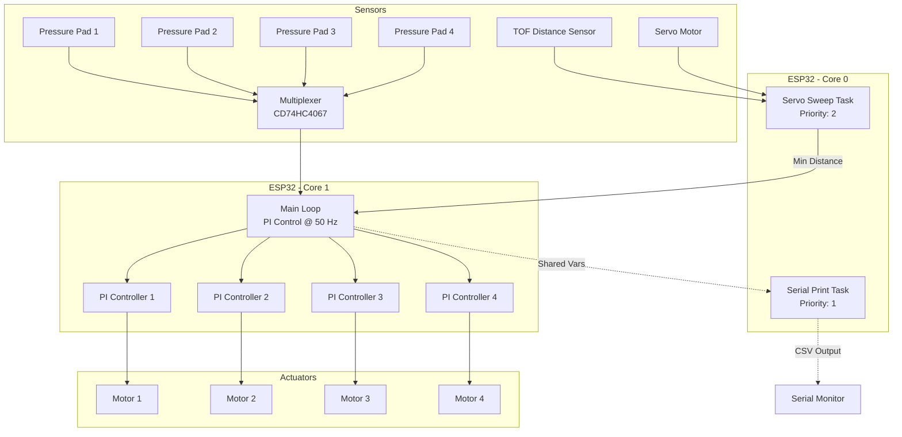
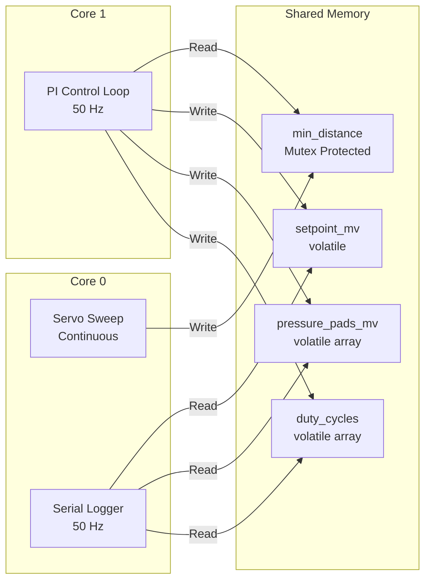
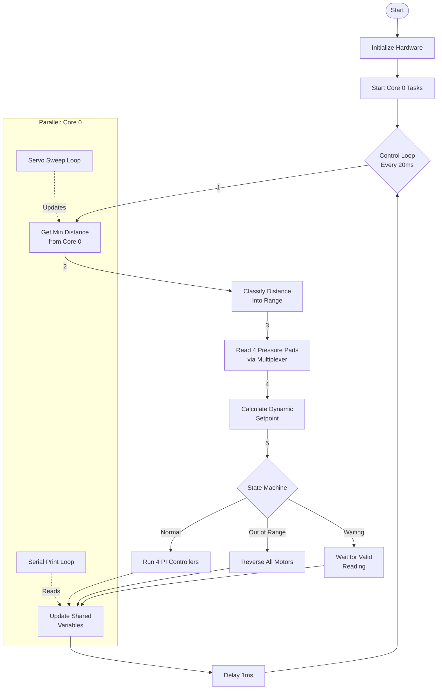
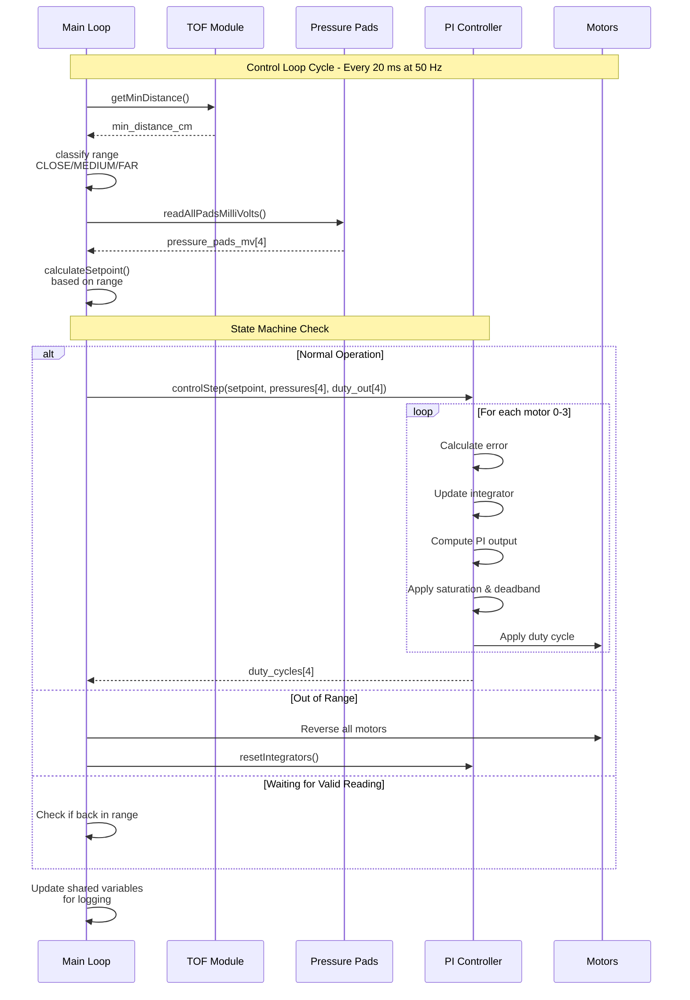
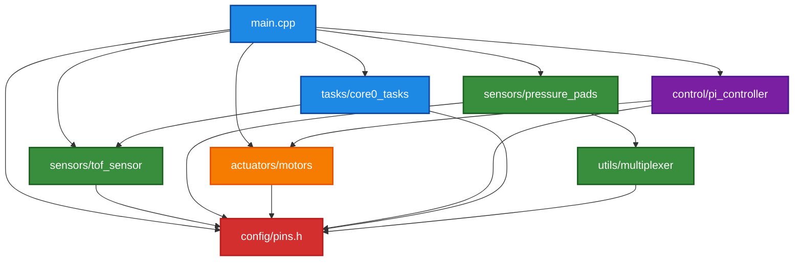

# System Architecture

This document describes the overall system architecture, data flow, and module interactions for the 4-Motor Independent PI Control System.

## Table of Contents

1. [System Overview](#system-overview)
2. [Multi-Core Architecture](#multi-core-architecture)
3. [Data Flow](#data-flow)
4. [Module Dependencies](#module-dependencies)
5. [Control Loop Timing](#control-loop-timing)

---

## System Overview

The system uses an ESP32 dual-core microcontroller to manage:
- **4 independent motors** with PI control
- **4 pressure pad sensors** for feedback
- **1 TOF distance sensor** with servo sweep for setpoint calculation
- **Real-time data logging** via Serial

---

## Multi-Core Architecture

The ESP32's dual cores are utilized to separate time-critical control from data acquisition and logging.

### Core 0: Data Acquisition & Logging

**Tasks:**
1. **Servo Sweep Task** (Priority 2)
   - Sweeps servo from 30° to 90°
   - Reads TOF distance at each angle
   - Finds minimum distance
   - Updates shared variables (mutex-protected)
   - Runs continuously

2. **Serial Print Task** (Priority 1)
   - Reads shared variables from Core 1
   - Outputs CSV data at 50 Hz
   - Lower priority to not interfere with sweep

### Core 1: Real-Time Control

**Main Loop:**
- Runs at exactly 50 Hz (20 ms period)
- Reads minimum distance from Core 0
- Reads 4 pressure pads via multiplexer
- Calculates dynamic setpoint
- Executes 4 independent PI controllers
- Applies motor commands
- Updates shared variables for logging

---

## Data Flow

### High-Level Data Flow

### Detailed Control Step (Core 1)

---

## Module Dependencies

### Module Descriptions

| Module | Purpose | Dependencies |
|--------|---------|--------------|
| **main.cpp** | System orchestration, main loop | All modules |
| **config/pins.h** | Pin definitions | None (base) |
| **sensors/tof_sensor** | TOF reading, servo sweep | pins.h |
| **sensors/pressure_pads** | Pressure pad reading | pins.h, multiplexer |
| **utils/multiplexer** | Analog multiplexer control | pins.h |
| **actuators/motors** | Motor PWM control | pins.h |
| **control/pi_controller** | PI algorithm for 4 motors | pins.h, motors |
| **tasks/core0_tasks** | FreeRTOS tasks for Core 0 | pins.h, tof_sensor |

---

## Control Loop Timing

### Timing Diagram

```mermaid
gantt
    title Control System Timing (One 20ms Cycle)
    dateFormat X
    axisFormat %L ms

    section Core 1 (Control)
    Get Min Distance    :0, 1
    Classify Range      :1, 1
    Read 4 Pressure Pads:2, 3
    Calculate Setpoint  :5, 1
    Run 4 PI Controllers:6, 4
    Update Motors       :10, 2
    Update Shared Vars  :12, 1
    Idle Time           :13, 7

    section Core 0 (Sweep)
    TOF Reading         :0, 5
    Move Servo          :5, 3
    TOF Reading         :8, 5
    Move Servo          :13, 3
    TOF Reading         :16, 4

    section Core 0 (Logger)
    Read Shared Vars    :0, 1
    Serial Print CSV    :1, 2
    Wait                :3, 17
```

### Timing Specifications

| Task | Frequency | Period | Execution Time | Core |
|------|-----------|--------|----------------|------|
| PI Control Loop | 50 Hz | 20 ms | ~10-15 ms | Core 1 |
| Servo Sweep | Continuous | ~4-5 s per full sweep | Variable | Core 0 |
| CSV Logger | 50 Hz | 20 ms | ~2-3 ms | Core 0 |
| Pressure Pad Read | 50 Hz | 20 ms | ~3-4 ms (4 channels × 8 samples) | Core 1 |
| TOF Single Read | Variable | N/A | ~50-100 ms | Core 0 |

### Critical Timing Constraints

1. **PI Control Must Run at 50 Hz**
   - Ensures stable control loop
   - Deadlines must be met to avoid jitter
   - Max execution time: <20 ms

2. **Mutex Access Must Be Fast**
   - Timeout: 10 ms maximum
   - Prevents blocking between cores
   - Ensures real-time responsiveness

3. **Multiplexer Settling Time**
   - 100 µs after channel switch
   - Required for accurate readings
   - Additional 50 µs between samples

4. **Servo Settling Time**
   - 80 ms per angle step
   - Allows mechanical stabilization
   - Critical for accurate TOF readings

---

## Summary

The architecture leverages the ESP32's dual cores to achieve:
- **Real-time control** at 50 Hz on Core 1
- **Parallel data acquisition** on Core 0
- **Thread-safe communication** via mutex-protected shared variables
- **Modular design** for easy maintenance and extension

This design ensures deterministic control loop timing while maintaining continuous sensor scanning and data logging.
