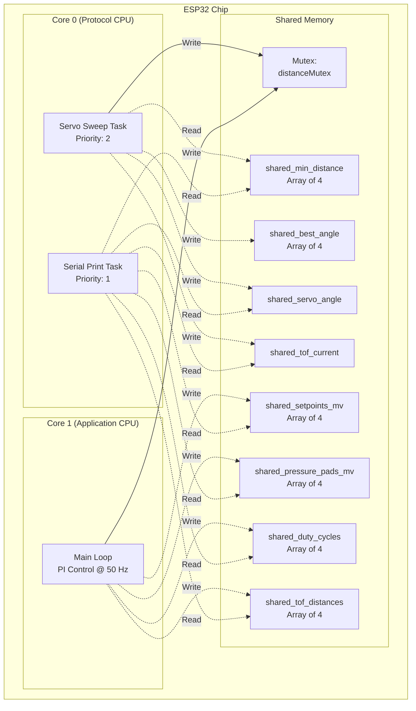
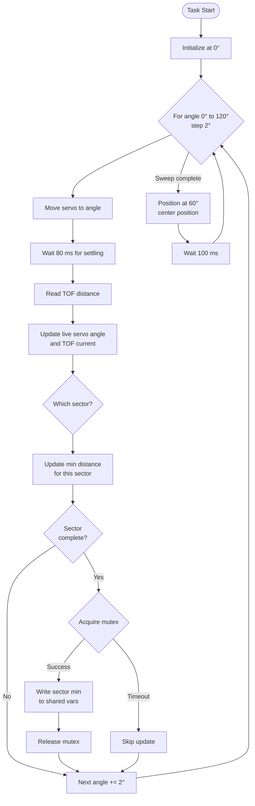
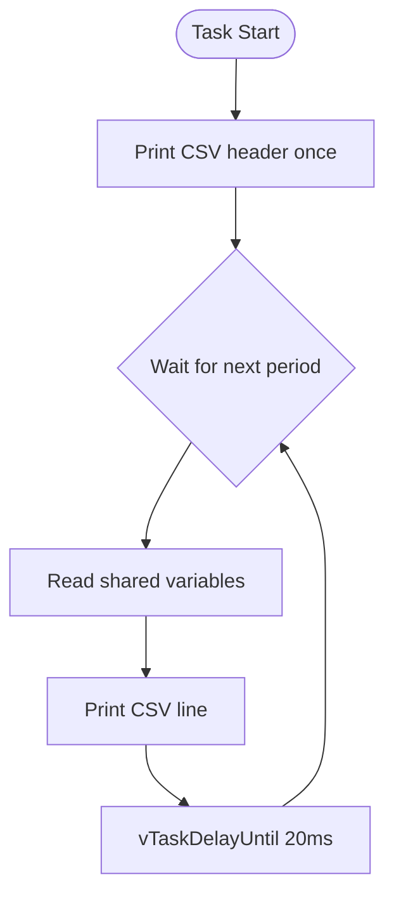
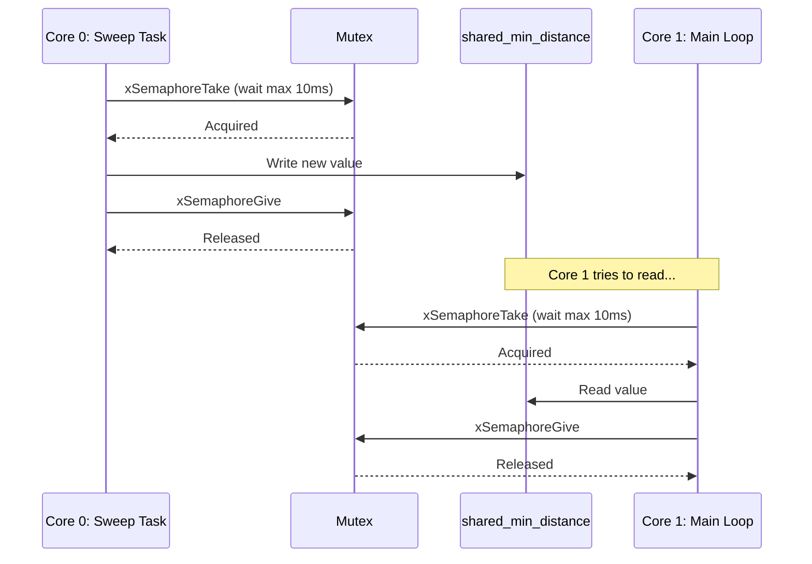

# Inter-Core Communication

This document explains the FreeRTOS architecture, inter-core communication mechanisms, and thread safety considerations for the dual-core ESP32 system.

## Table of Contents

1. [ESP32 Dual-Core Overview](#esp32-dual-core-overview)
2. [Task Architecture](#task-architecture)
3. [Shared Variables](#shared-variables)
4. [Mutex Protection](#mutex-protection)
5. [Synchronization Mechanisms](#synchronization-mechanisms)
6. [Best Practices](#best-practices)

---

## ESP32 Dual-Core Overview

The ESP32 microcontroller features two Xtensa LX6 cores running at up to 240 MHz. Both cores share the same memory space, enabling efficient data exchange but requiring careful synchronization.

### Core Assignment

| Core | Tasks | Purpose |
|------|-------|---------|
| **Core 0** | Servo Sweep Task, Serial Print Task | Data acquisition and logging |
| **Core 1** | Main Loop (default Arduino loop) | Real-time PI control |



### Why This Split?

**Core 0 Advantages:**
- Less critical for system stability (Core 1 runs WiFi/BT stack in some applications)
- Ideal for background tasks (servo sweep, logging)
- FreeRTOS scheduler manages task priorities

**Core 1 Advantages:**
- Arduino `loop()` runs here by default
- More predictable timing for real-time control
- Dedicated to PI control at fixed 50 Hz

---

## Task Architecture

### FreeRTOS Tasks on Core 0

#### 1. Servo Sweep Task

**Function:** `servoSweepTask()`
**Priority:** 2 (higher)
**Stack:** 4096 bytes

```cpp
xTaskCreatePinnedToCore(
    servoSweepTask,       // Task function
    "ServoSweep",         // Name
    4096,                 // Stack size
    NULL,                 // Parameters
    2,                    // Priority
    NULL,                 // Task handle
    0                     // Core 0
);
```

**Responsibilities:**
- Continuously sweep servo from 0° to 120°
- Read TOF distance at each angle
- Track minimum distance for each of 4 sectors (0-30°, 31-60°, 61-90°, 91-120°)
- Update `shared_min_distance[4]` and `shared_best_angle[4]` (mutex-protected) when each sector completes
- Update `shared_servo_angle` and `shared_tof_current` for live radar display

**Execution Flow:**


#### 2. Serial Print Task

**Function:** `serialPrintTask()`
**Priority:** 1 (lower)
**Stack:** 4096 bytes

```cpp
xTaskCreatePinnedToCore(
    serialPrintTask,      // Task function
    "SerialPrint",        // Name
    4096,                 // Stack size
    NULL,                 // Parameters
    1,                    // Priority
    NULL,                 // Task handle
    0                     // Core 0
);
```

**Responsibilities:**
- Read shared variables from Core 1
- Output binary (70 bytes) or CSV data at configurable rate (10-100 Hz)
- Send to WebSocket bridge or serial monitor
- No mutex needed (reads volatile variables)

**Execution Flow:**


### Main Loop on Core 1

**Function:** `loop()`
**Frequency:** 50 Hz (20 ms period)
**Core:** Core 1 (default)

**Responsibilities:**
- Read minimum distance from Core 0 (mutex-protected)
- Read 4 pressure pads via multiplexer
- Calculate dynamic setpoint
- Execute 4 PI controllers
- Update motors
- Write shared variables for logging

---

## Shared Variables

### Mutex-Protected Variables (Critical Section)

These variables are written by Core 0 (servo sweep task) and read by Core 1 (main loop):

```cpp
// Declared in tof_sensor.cpp
SemaphoreHandle_t distanceMutex = NULL;
volatile float shared_min_distance = 999.0f;
volatile int shared_best_angle = SERVO_MIN_ANGLE;
volatile bool sweep_active = false;
```

**Access Pattern:**

**Core 0 (Writer):**
```cpp
// Servo sweep task
if (xSemaphoreTake(distanceMutex, pdMS_TO_TICKS(10)) == pdTRUE) {
    shared_min_distance = min_distance_this_sweep;
    shared_best_angle = angle_of_min;
    xSemaphoreGive(distanceMutex);
}
```

**Core 1 (Reader):**
```cpp
// Main loop
float min_distance_cm = getMinDistance();  // Uses mutex internally

// Inside getMinDistance():
float distance = 999.0f;
if (xSemaphoreTake(distanceMutex, pdMS_TO_TICKS(10)) == pdTRUE) {
    distance = shared_min_distance;
    xSemaphoreGive(distanceMutex);
}
return distance;
```

### Volatile Variables (Non-Critical)

These variables are written by Core 1 and read by Core 0 (serial print task):

```cpp
// Declared in core0_tasks.cpp
volatile float shared_setpoint_mv = 0.0f;
volatile uint16_t shared_pressure_pads_mv[4] = {0};
volatile float shared_duty_cycles[4] = {0.0f};
volatile float shared_tof_distance = 0.0f;
```

**Why no mutex here?**
- Single writer (Core 1), single reader (Core 0)
- Reads are for logging only (not critical)
- `volatile` ensures memory is not cached
- ESP32 guarantees atomic 32-bit reads/writes

**Access Pattern:**

**Core 1 (Writer):**
```cpp
// Main loop - no mutex needed
shared_setpoint_mv = current_setpoint_mv;
for (int i = 0; i < NUM_MOTORS; ++i) {
    shared_pressure_pads_mv[i] = pressure_pads_mv[i];
    shared_duty_cycles[i] = duty_cycles[i];
}
shared_tof_distance = min_distance_cm;
```

**Core 0 (Reader):**
```cpp
// Serial print task - no mutex needed
float setpoint = shared_setpoint_mv;
uint16_t pp_mv[NUM_MOTORS];
float duty[NUM_MOTORS];
for (int i = 0; i < NUM_MOTORS; ++i) {
    pp_mv[i] = shared_pressure_pads_mv[i];
    duty[i] = shared_duty_cycles[i];
}
```

---

## Mutex Protection

### What is a Mutex?

A **mutex** (mutual exclusion) is a synchronization primitive that ensures only one task can access a shared resource at a time.



### Creating a Mutex

```cpp
// In tof_sensor.cpp
SemaphoreHandle_t distanceMutex = NULL;

void initTOFSensor() {
    // ... other init code ...

    // Create binary semaphore (mutex)
    distanceMutex = xSemaphoreCreateMutex();
    if (distanceMutex == NULL) {
        Serial.println("ERROR: Failed to create distance mutex!");
    }
}
```

### Taking and Giving a Mutex

**Taking (Locking):**
```cpp
if (xSemaphoreTake(distanceMutex, pdMS_TO_TICKS(10)) == pdTRUE) {
    // Critical section - mutex held
    // Access shared variables here
    shared_min_distance = new_value;

    // Always release mutex!
    xSemaphoreGive(distanceMutex);
} else {
    // Timeout - mutex not acquired
    // Handle error or skip operation
}
```

**Key Points:**
- **Timeout:** `pdMS_TO_TICKS(10)` = 10 ms max wait
- **Always release:** Forgetting `xSemaphoreGive()` causes deadlock
- **Short critical sections:** Hold mutex for as little time as possible

### When to Use a Mutex

| Scenario | Mutex Needed? |
|----------|---------------|
| Multiple cores writing to same variable | ✅ Yes |
| Multiple cores reading same variable | ⚠️ Depends on data type |
| Single writer, single reader (32-bit) | ❌ No (use `volatile`) |
| Array/struct access by multiple cores | ✅ Yes |
| Read-modify-write operations | ✅ Yes |

---

## Synchronization Mechanisms

### 1. Mutex (Used in This Project)

**Purpose:** Protect critical sections from concurrent access

**Pros:**
- Simple to use
- Prevents race conditions
- Supported by FreeRTOS

**Cons:**
- Can cause priority inversion
- Overhead from context switching

### 2. Volatile Keyword (Used in This Project)

**Purpose:** Prevent compiler optimizations that assume variables don't change

```cpp
volatile float shared_setpoint_mv = 0.0f;
```

**What `volatile` does:**
- Forces reads/writes to go to memory (not CPU cache)
- Prevents compiler from optimizing away repeated reads

**What `volatile` does NOT do:**
- Does NOT guarantee atomicity
- Does NOT prevent race conditions on complex data

### 3. Atomic Operations (Not Used, but Available)

ESP32 supports atomic operations for simple types:

```cpp
#include <atomic>
std::atomic<uint32_t> counter{0};

// Atomic increment
counter.fetch_add(1);

// Atomic read
uint32_t value = counter.load();
```

**When to use:**
- Simple counters or flags
- Performance-critical code
- Replacing mutex for basic operations

### 4. Task Notifications (Alternative to Semaphores)

FreeRTOS task notifications can replace semaphores for signaling:

```cpp
// Sender task
xTaskNotifyGive(targetTaskHandle);

// Receiver task
ulTaskNotifyTake(pdTRUE, portMAX_DELAY);
```

**Advantages:**
- Faster than semaphores
- Lower memory overhead

**Not used in this project** because mutexes are more intuitive for shared data protection.

---

## Best Practices

### 1. Minimize Critical Sections

**Bad:**
```cpp
xSemaphoreTake(mutex, 10);
processData();            // Long operation
calculateResult();        // More processing
shared_result = result;
xSemaphoreGive(mutex);
```

**Good:**
```cpp
processData();            // Do work OUTSIDE critical section
calculateResult();

xSemaphoreTake(mutex, 10);
shared_result = result;   // Quick write
xSemaphoreGive(mutex);
```

### 2. Always Release Mutexes

**Bad:**
```cpp
if (xSemaphoreTake(mutex, 10) == pdTRUE) {
    if (error_condition) {
        return;  // FORGOT TO RELEASE!
    }
    xSemaphoreGive(mutex);
}
```

**Good:**
```cpp
if (xSemaphoreTake(mutex, 10) == pdTRUE) {
    if (error_condition) {
        xSemaphoreGive(mutex);  // Release before return
        return;
    }
    xSemaphoreGive(mutex);
}
```

### 3. Use Appropriate Timeouts

- **10 ms** for normal operations (allows context switching)
- `portMAX_DELAY` for operations that can wait indefinitely
- `0` for non-blocking attempts

### 4. Avoid Nested Mutexes (Deadlock Risk)

**Bad:**
```cpp
xSemaphoreTake(mutex1, 10);
xSemaphoreTake(mutex2, 10);  // Risk of deadlock
// ...
xSemaphoreGive(mutex2);
xSemaphoreGive(mutex1);
```

**Better:** Use a single mutex for related data or ensure consistent lock order.

### 5. Declare Shared Variables as Volatile

```cpp
volatile float shared_data = 0.0f;
```

This ensures:
- Compiler doesn't optimize away reads
- Memory is accessed, not cache

### 6. Use Wrapper Functions for Mutex Access

Instead of exposing mutex and shared variables, provide accessor functions:

```cpp
// Good: Encapsulation
float getMinDistance() {
    float distance = 999.0f;
    if (xSemaphoreTake(distanceMutex, pdMS_TO_TICKS(10)) == pdTRUE) {
        distance = shared_min_distance;
        xSemaphoreGive(distanceMutex);
    }
    return distance;
}

// Usage
float dist = getMinDistance();  // Clean and safe
```

---

## Debugging Inter-Core Issues

### Common Problems

#### 1. Race Conditions

**Symptoms:**
- Intermittent bugs
- Data corruption
- Values changing unexpectedly

**Solution:**
- Add mutex protection
- Use `volatile` keyword
- Verify atomic access

#### 2. Deadlock

**Symptoms:**
- System freezes
- Watchdog timer resets

**Solution:**
- Use timeouts (not `portMAX_DELAY`)
- Avoid nested mutexes
- Check for missing `xSemaphoreGive()`

#### 3. Priority Inversion

**Symptoms:**
- High-priority task blocked by low-priority task
- Unpredictable delays

**Solution:**
- Use priority inheritance (enabled by default for mutexes)
- Minimize mutex hold time

### Debugging Techniques

1. **Add Serial Debug Prints:**
   ```cpp
   Serial.printf("[Core %d] Mutex acquired\n", xPortGetCoreID());
   ```

2. **Check Current Core:**
   ```cpp
   Serial.printf("Running on core: %d\n", xPortGetCoreID());
   ```

3. **Monitor Stack Usage:**
   ```cpp
   UBaseType_t stackRemaining = uxTaskGetStackHighWaterMark(NULL);
   Serial.printf("Stack remaining: %u bytes\n", stackRemaining);
   ```

4. **Use FreeRTOS Task Stats:**
   ```cpp
   char buffer[512];
   vTaskList(buffer);
   Serial.println(buffer);
   ```

---

## Summary

The dual-core architecture provides:
- **Core 0:** Background tasks (servo sweep, logging) with FreeRTOS scheduling
- **Core 1:** Real-time PI control at deterministic 50 Hz

**Key synchronization mechanisms:**
- **Mutex** for TOF distance variables (critical data)
- **Volatile** for logging variables (non-critical, single writer)
- **Wrapper functions** for clean, encapsulated access

This design ensures:
- Thread-safe data access
- Deterministic control loop timing
- Efficient resource utilization

**Golden Rule:** When in doubt, use a mutex. It's better to be safe than debug race conditions!
