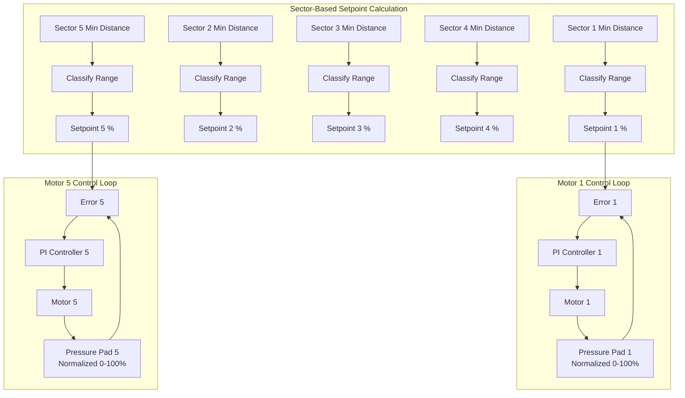
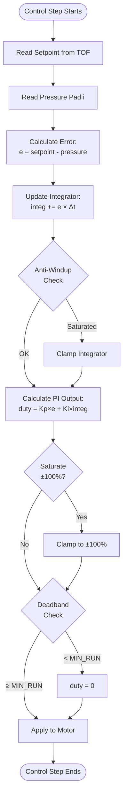
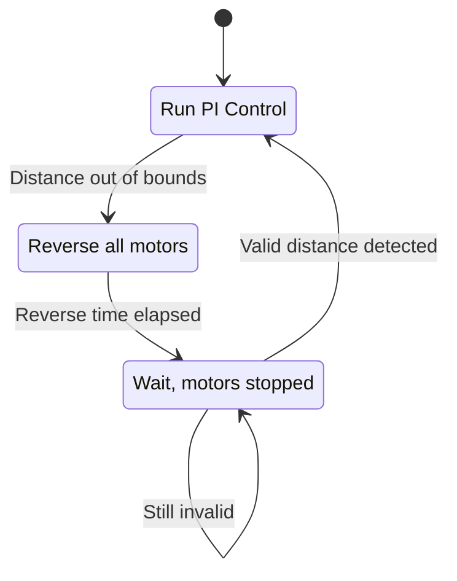

# Control System Design

This document explains the PI (Proportional-Integral) control system, dynamic setpoint calculation, and tuning procedures for the 5-motor control system.

## Table of Contents

1. [Control System Overview](#control-system-overview)
2. [PI Controller Theory](#pi-controller-theory)
3. [Dynamic Setpoint Calculation](#dynamic-setpoint-calculation)
4. [Implementation Details](#implementation-details)
5. [Tuning Guide](#tuning-guide)
6. [State Machine](#state-machine)

---

## Control System Overview

The system uses **5 independent PI controllers**, one for each motor-actuator pair. Each motor uses the minimum distance from its corresponding servo sweep sector to calculate its own dynamic setpoint. Pressure values are normalized to 0-100% based on calibrated prestress (0%) and maxstress×0.95 (100%).



**Key Features:**
- **Independent Control**: Each motor has its own integrator state and sector-based setpoint
- **Sector-Based Setpoints**: Each motor uses its corresponding servo sweep sector's minimum distance
- **Normalized Pressure**: All pressure values are normalized to 0-100% based on calibration
- **Potentiometer Scaling**: Force scale (0.6-1.0) and distance scale (0.5-1.5) adjustable via potentiometers
- **Fixed Frequency**: 50 Hz control loop for deterministic behavior

---

## PI Controller Theory

### Basic PI Equation

The PI controller computes the motor duty cycle based on the error between setpoint and measured pressure:

```
u(t) = Kp × e(t) + Ki × ∫e(τ)dτ
```

Where:
- `u(t)` = control output (duty cycle %)
- `e(t)` = error = setpoint - measured_pressure
- `Kp` = proportional gain
- `Ki` = integral gain
- `∫e(τ)dτ` = accumulated error over time (integrator)

### Discrete-Time Implementation

Since the controller runs at a fixed frequency (50 Hz), we use a discrete approximation:

```
e[k] = setpoint - pressure[k]
integrator[k] = integrator[k-1] + e[k] × Δt
duty[k] = Kp × e[k] + Ki × integrator[k]
```

Where:
- `k` = current time step
- `Δt` = sampling period = 1/50 = 0.02 seconds

### Control Flow Diagram



---

## Dynamic Setpoint Calculation

The setpoint is **not constant**—it adapts based on the TOF sensor's measured distance to an obstacle.

### Distance Ranges

The system defines three operating ranges with **dynamic thresholds** adjustable via potentiometer 2 (distance scale 0.5-1.5):

| Range | Base Distance (cm) | Scaled Range | Setpoint (%) | Behavior |
|-------|-------------------|--------------|--------------|----------|
| **CLOSE** | 0 - 100 | 75 - 125 cm | High (fixed) | High pressure for strong contact |
| **MEDIUM** | 100 - 200 | 125 - 275 cm | Medium (fixed) | Moderate pressure |
| **FAR** | 200 - 300 | 150 - 450 cm | Low (baseline + offset) | Gentle touch |
| **OUT OF BOUNDS** | < 0 or > max | Varies | Invalid | Triggers safety reversal |

**Note:** All distance thresholds are multiplied by the distance scale factor from potentiometer 2. The force scale from potentiometer 1 affects the setpoint magnitude.

### Setpoint Calculation Logic

```cpp
float calculateSetpoint(DistanceRange range, float baseline_pressure_mv) {
    switch (range) {
        case RANGE_FAR:
            // Fixed baseline approach: 500mV baseline + 50mV security offset
            // This accounts for friction variations between motors over time
            return baseline_pressure_mv + SECURITY_OFFSET_MV;

        case RANGE_MEDIUM:
            // Fixed medium setpoint
            return SETPOINT_MEDIUM_MV;

        case RANGE_CLOSE:
            // Fixed high setpoint for strong contact
            return SETPOINT_CLOSE_MV;

        default:
            return -1.0f;  // Invalid
    }
}
```

### Rationale for FAR Range Baseline

When the obstacle is far away (200-300 cm):
- We use a fixed baseline pressure (500 mV) captured when entering FAR range
- A security offset (50 mV) is added for gentle contact
- This approach accounts for friction variations between different motors
- The baseline is reset on each MEDIUM→FAR transition to adapt to changing conditions
- Target setpoint: 550 mV (500 mV baseline + 50 mV offset)

---

## Implementation Details

### Control Parameters

| Parameter | Value | Description |
|-----------|-------|-------------|
| **Kp** | 0.15 | Proportional gain |
| **Ki** | 0.60 | Integral gain |
| **Control Frequency** | 50 Hz | Loop rate (20 ms period) |
| **Δt** | 0.02 s | Sampling period |
| **DUTY_MIN** | -100% | Minimum duty cycle (full reverse) |
| **DUTY_MAX** | +100% | Maximum duty cycle (full forward) |
| **MIN_RUN** | 40% | Deadband threshold |

### Anti-Windup

To prevent integrator windup (accumulation of error when output is saturated), we clamp the integrator:

```cpp
float integrator_max = DUTY_MAX / max(Ki, 0.0001f);

if (integrator > integrator_max) {
    integrator = integrator_max;
}
if (integrator < -integrator_max) {
    integrator = -integrator_max;
}
```

This ensures that:
- `Ki × integrator ≤ DUTY_MAX`
- The integrator doesn't grow unbounded during saturation

### Saturation

The output duty cycle is clamped to prevent exceeding motor limits:

```cpp
if (duty > DUTY_MAX) duty = DUTY_MAX;  // +100%
if (duty < DUTY_MIN) duty = DUTY_MIN;  // -100%
```

### Deadband

Motors require a minimum PWM duty cycle to overcome static friction. Below this threshold, the motor won't move. We apply a deadband:

```cpp
if (abs(duty) < MIN_RUN) {
    duty = 0;  // Stop motor
}
```

This prevents:
- Wasted energy (motor powered but not moving)
- Audible buzzing from motors
- Overheating at low duty cycles

---

## Tuning Guide

### Step-by-Step Tuning Procedure

#### 1. Start with Conservative Gains

Begin with low gains to ensure stability:

```cpp
Kp = 0.05;
Ki = 0.10;
```

#### 2. Tune Proportional Gain (Kp)

1. Set `Ki = 0` (disable integral action)
2. Gradually increase `Kp` until you see:
   - Fast response to setpoint changes
   - Small oscillations around setpoint
3. Reduce `Kp` by 20-30% for stability margin

**Signs of too high Kp:**
- Large oscillations
- System instability
- Motors oscillating rapidly

**Signs of too low Kp:**
- Slow response
- Large steady-state error
- Sluggish performance

#### 3. Tune Integral Gain (Ki)

1. With `Kp` set from step 2, gradually increase `Ki`
2. Watch for:
   - Elimination of steady-state error
   - Pressure converging to setpoint over time
3. Stop increasing when you see overshoot or slow oscillations

**Signs of too high Ki:**
- Overshoot (pressure exceeds setpoint)
- Slow oscillations (period > 2 seconds)
- Integrator windup issues

**Signs of too low Ki:**
- Persistent steady-state error
- Never quite reaches setpoint

#### 4. Fine-Tune Both Gains

Make small adjustments to both `Kp` and `Ki` for optimal performance:
- Increase `Kp` for faster response
- Increase `Ki` for better tracking
- Balance speed vs. stability

### Current Tuning

The current tuning (`Kp = 0.15`, `Ki = 0.60`) was chosen to:
- Provide quick response to setpoint changes
- Eliminate steady-state error within ~1 second
- Maintain stability across all three distance ranges

### Tuning for Different Scenarios

| Scenario | Recommended Adjustment |
|----------|------------------------|
| System oscillates | Reduce `Kp` by 20-30% |
| Slow response | Increase `Kp` by 10-20% |
| Steady-state error | Increase `Ki` by 10-20% |
| Overshoot | Reduce `Ki` by 20-30% |
| Different motor/load | Retune from scratch |
| Higher friction | Increase deadband `MIN_RUN` |

### Advanced Tuning: Ziegler-Nichols Method

If you want a more systematic approach:

1. **Find Ultimate Gain (Ku):**
   - Set `Ki = 0`
   - Increase `Kp` until system oscillates continuously
   - Record `Ku` (critical gain) and `Tu` (oscillation period)

2. **Calculate PI Gains:**
   ```
   Kp = 0.45 × Ku
   Ki = 1.2 × Kp / Tu
   ```

3. **Fine-tune** from these starting values

---

## State Machine

The control system includes a state machine to handle out-of-range conditions safely.

### States



### State Descriptions

#### 1. NORMAL_OPERATION

- **Behavior:** PI control active for all 5 motors
- **Transition:** If distance < 50 cm or > 300 cm → `OUT_OF_RANGE_REVERSING`

#### 2. OUT_OF_RANGE_REVERSING

- **Behavior:**
  - All motors reverse at 60% duty cycle
  - Duration: 500 ms
  - Integrators reset to prevent windup
- **Transition:** After 500 ms → `WAITING_FOR_VALID_READING`

#### 3. WAITING_FOR_VALID_READING

- **Behavior:**
  - All motors stopped (braked)
  - System waits for distance to return to valid range
- **Transition:** When distance is 50-300 cm → `NORMAL_OPERATION`

### Safety Logic

```cpp
if (distance < 50 || distance > 300) {
    // Too close or too far - back away
    for (int i = 0; i < 4; i++) {
        motorReverse(i, 60.0);
    }
    resetIntegrators();
}
```

This ensures:
- System doesn't push too hard when very close
- System retreats if object moves out of range
- Prevents damage to hardware or obstacle

---

## Performance Metrics

### Expected Behavior (Well-Tuned System)

| Metric | Target | Notes |
|--------|--------|-------|
| **Rise Time** | < 1 second | Time to reach 90% of setpoint |
| **Settling Time** | < 2 seconds | Time to stabilize within ±5% |
| **Steady-State Error** | < 10 mV | With integral control |
| **Overshoot** | < 10% | Minimal overshoot desired |
| **Control Frequency** | 50 Hz | Fixed (not adjustable) |

### Monitoring Performance

Use the CSV data output to analyze performance:

```
time_ms,setpoint_mv,pp1_mv,pp2_mv,pp3_mv,pp4_mv,duty1_pct,duty2_pct,duty3_pct,duty4_pct,tof_dist_cm
```

**Plot these in a spreadsheet or Python:**
1. Setpoint vs. Pressure (per motor) → shows tracking performance
2. Duty cycle vs. Time → shows control effort
3. TOF distance vs. Time → shows range transitions

### Example Analysis

Good performance:
- Pressure smoothly approaches setpoint
- Duty cycle stabilizes
- No large oscillations

Poor performance (needs tuning):
- Pressure oscillates around setpoint
- Duty cycle bounces between extremes
- Large overshoot or slow response

---

## Troubleshooting Control Issues

### Problem: Motor oscillates rapidly

**Cause:** `Kp` too high
**Solution:** Reduce `Kp` by 30-50%

### Problem: Slow response to setpoint changes

**Cause:** `Kp` too low
**Solution:** Increase `Kp` by 20-30%

### Problem: Never reaches setpoint (steady-state error)

**Cause:** `Ki` too low or zero
**Solution:** Increase `Ki` gradually

### Problem: Overshoot and slow oscillations

**Cause:** `Ki` too high
**Solution:** Reduce `Ki` by 30-50%

### Problem: Motor doesn't move at all

**Causes:**
1. Deadband `MIN_RUN` too high
2. Pressure already at setpoint
3. Motor power issue

**Solutions:**
1. Reduce `MIN_RUN` from 40% to 30%
2. Change setpoint to test
3. Check H-bridge and power connections

### Problem: Control becomes unstable after range transition

**Cause:** Large setpoint jump overwhelms integrator
**Solution:** Already handled by `resetIntegrators()` on range change

---

## Further Reading

- [PID Controller on Wikipedia](https://en.wikipedia.org/wiki/PID_controller)
- [Ziegler-Nichols Tuning](https://en.wikipedia.org/wiki/Ziegler%E2%80%93Nichols_method)
- [Anti-Windup Techniques](https://en.wikipedia.org/wiki/Integral_windup)

---

## Summary

The 5-motor control system uses well-tuned PI controllers with:
- **Kp = 0.15** for fast response
- **Ki = 0.60** for zero steady-state error
- **Anti-windup** to prevent integrator saturation
- **Normalized pressure values** (0-100%) based on calibration
- **Sector-based dynamic setpoints** from TOF distance (each motor has its own sector)
- **Potentiometer scaling** for force (0.6-1.0) and distance (0.5-1.5)
- **Dynamic distance thresholds** adjustable in real-time
- **State machine** for safe out-of-range handling (per motor)

This design provides robust, stable control across varying distances and loads with real-time adjustability via potentiometers.
